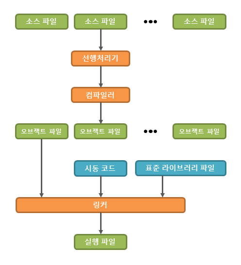
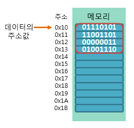

# C-language-docs
## 목차
* [개요][1.]
  + [C언어 탄생의 배경][1.1.]
* [C 프로그래밍][2.]
  + [소스 파일 작성][2.1.] 
  + [선행처리기 & 선행처리][2.2.]
  + [컴파일러 & 컴파일][2.3.]
  + [링커 & 링크][2.4.]
  + [실행 파일의 생성][2.5.]
* [C언어 표준 입출력][3.]
  + [printf 함수][3.1.]
  + [scanf 함수][3.2.]
  + [서식 지정자][3.3.]
* [변수][4.]
  + [비트 & 바이트][4.1.]
  + [변수와 메모리 구조][4.2.]
  + [상수][4.3.]
  + [정수형 타입][4.4.]
  + [실수형 타입][4.5.]
  + [문자형 타입][4.6.]
  + [타입 변환][4.7.]
  + [묵시적 타입 변환][4.8.]
  + [명시적 타입 변환][4.9.]
* [5. 연산자][5.]
  + [5.1. 산술 연산자][5.1.]
  + [5.2. 대입 연산자][5.2.]
  + [5.3. 증감 연산자][5.3.]
  + [5.4. 비교 연산자][5.4.]
  + [5.5. 논리 연산자][5.5.]
* [6. 함수][6.]
  + [6.1. 함수의 원형 선언][6.1.]
  + [6.2. 변수의 유효 범위][6.2.]
  + [6.3. 재귀 호출][6.3.]
* [7. 배열][7.]
  + [7.1. 1차원 배열][7.1.]
  + [7.2. 다차원 배열][7.2.]
  + [7.3. 배열의 특징][7.3.]
  + [7.4. 배열이 차지하는 메모리의 크기][7.4.]
* [8. 포인터][8.]
  + [8.1. 포인터의 개념][8.1.]
  + [8.2. 포인터 연산][8.2.]
  + [8.3. 값에 의한 전달][8.3.]
  + [8.4. 참조에 의한 전달][8.4.]
  + [8.5. 다양한 포인터][8.5.]
* [9. 포인터와 배열의 관계][9.]
  + [9.1. 배열의 포인터 연산][9.1.]
  + [9.2. 포인터 배열][9.2.]
  + [9.3. 배열 포인터][9.3.]
  + [9.4. 포인터 배열과 배열 포인터의 구분][9.4.]
  + [9.5. main() 함수의 인수 전달][9.5.]
* [10. 메모리의 구조][10.]
  + [10.1. 코드 영역][10.1.]
  + [10.2. 데이터 영역][10.2.]
  + [10.3. 스택 영역][10.3.]
  + [10.4. 힙 영역][10.4.]
  + [10.5. 스택 프레임][10.5.]
  + [10.6. 스택 오버플로우][10.6.]
  + [10.7. 메모리의 동적 할당][10.7.]
* [11. 문자와 문자열][11.]
  + [11.1. 스트림][11.1.]
  + [11.2. EOF(End Of File)][11.2.]
* [12. 구조체][12.]
  + [12.1. 포인터와 구조체][12.1.]
  + [12.2. 함수와 구조체][12.2.]
  + [12.3. 중첩된 구조체][12.3.]
  + [12.4. 구조체의 크기][12.4.]
  + [12.5. 바이트 패딩][12.5.]
  + [12.6. 공용체][12.6.]
  + [12.7. 열거체][12.7.]

[1.]: #1-개요
[1.1.]: #11-c언어의-탄생-배경
[2.]: #2-c-프로그래밍
[2.1.]: #21-소스-파일-작성
[2.2.]: #22-선행처리기--선행처리
[2.3.]: #23-컴파일러--컴파일
[2.4.]: #24-링커--링크
[2.5.]: #25-실행-파일의-생성
[3.]: #3-c언어-표준-입출력
[3.1.]: #31-printf-함수
[3.2.]: #32-scanf-함수
[3.3.]: #33-서식-지정자
[4.]: #4-변수
[4.1.]: #41-비트--바이트
[4.2.]: #42-변수와-메모리-구조
[4.3.]: #43-상수
[4.4.]: #44-정수형-타입
[4.5.]: #45-실수형-타입
[4.6.]: #46-문자형-타입
[4.7.]: #47-타입-변환
[4.8.]: #48-묵시적-타입-변환
[4.9.]: #49-명시적-타입-변환
[5.]: #5-연산자
[5.1.]: #51-산술-연산자
[5.2.]: #52-대입-연산자
[5.3.]: #53-증감-연산자
[5.4.]: #54-비교-연산자
[5.5.]: #55-논리-연산자
[6.]: #6-함수
[6.1.]: #61-함수의-원형-선언
[6.2.]: #62-변수의-유효-범위
[6.3.]: #63-재귀-호출
[7.]: #7-배열
[7.1.]: #71-1차원-배열
[7.2.]: #72-다차원-배열
[7.3.]: #73-배열의-특징
[7.4.]: #74-배열이-차지하는-메모리의-크기
[8.]: #8-포인터
[8.1.]: #81-포인터의-개념
[8.2.]: #82-포인터-연산
[8.3.]: #83-값에-의한-전달
[8.4.]: #84-참조에-의한-전달
[8.5.]: #85-다양한-포인터
[9.]: #9-포인터와-배열의-관계
[9.1.]: #91-배열의-포인터-연산
[9.2.]: #92-포인터-배열
[9.3.]: #93-배열-포인터
[9.4.]: #94-포인터-배열과-배열-포인터의-구분
[9.5.]: #95-main-함수의-인수-전달
[10.]: #10-메모리의-구조
[10.1.]: #101-코드-영역
[10.2.]: #102-데이터-영역
[10.3.]: #103-스택-영역
[10.4.]: #104-힙-영역
[10.5.]: #105-스택-프레임
[10.6.]: #106-스택-오버플로우
[10.7.]: #107-메모리의-동적-할당
[11.]: #11-문자와-문자열
[11.1.]: #111-스트림
[11.2.]: #112-eofend-of-file
[12.]: #12-구조체
[12.1.]: #121-포인터와-구조체
[12.2.]: #122-함수와-구조체
[12.3.]: #123-중첩된-구조체
[12.4.]: #124-구조체의크기
[12.5.]: #125-바이트-패딩
[12.6.]: #126-공용체
[12.7.]: #127-열거체

# 1. 개요
C언어는 현재 사용되고 있는 거의 모든 컴퓨터 시스템에서 사용할 수 있는 프로그래밍 언어이다.   
**현재 널리 사용되는 주요 운영체제의 커널은 대부분 C언어를 이용해 구현되어 있다.**   
이처럼 C언어는 시스템 프로그래밍에 가장 잘 어울리지만, 응용 프로그래밍에도 많이 사용되는 프로그래밍 언어이다.

## 1.1. C언어의 탄생 배경
C언어 이전에 유닉스 운영체제는 어셈블리어라는 저급 언어를 사용했다.   
**어셈블리어는 특정 하드웨어에 종속적인 언어여서, 이 언어로 작성된 프로그램은 다른 하드웨어로 이식할 수 없었다.**   
**즉, 하나의 기능을 하는 프로그램을 CPU의 종류만큼 여러 번 작성해야만 했다.**  
따라서 이식성 좋고, 어셈블리어보다 쉬운 언어가 필요했으며 그래서 개발된 언어가 바로 C언어이다.   

# 2. C 프로그래밍
프로그래밍이란 목적에 맞는 알고리즘으로부터 프로그래밍 언어를 사용하여 구체적인 프로그램을 작성하는 과정을 의미한다.   
이렇게 작성된 **프로그램은 먼저 실행 파일(executable file)로 변환되어야 실행할 수 있다.**

C언어에서 실행 파일을 생성하는 순서는 다음 그림과 같다.

1. 소스 파일(source file)의 작성
2. 선행처리기(preprocessor)에 의한 선행처리
3. 컴파일러(compiler)에 의한 컴파일
4. 링커(linker)에 의한 링크
5. 실행 파일(executable file)의 생성

## 2.1. 소스 파일 작성
프로그래밍에서 가장 먼저 해야 할 작업은 바로 프로그램을 작성하는 것이다.  
**C언어를 사용하여 문법에 맞게 논리적으로 작성된 프로그램을 원시 파일 또는 소스 파일이라고 한다.**   
C언어를 통해 작성된 소스 파일의 확장자는 .c 가 된다.

## 2.2. 선행처리기 & 선행처리
**선행처리(preprocess)란 소스 파일 중에서도 선행처리 문자(#)로 시작하는 선행처리 지시문의 처리 작업을 의미한다.**   
이러한 선행처리 작업은 선행처리기(preprocessor)가 수행한다.  
**선행처리기는 코드를 생성하는 것이 아닌, 컴파일하기 전 컴파일러가 작업하기 좋도록 소스를 재구성해주는 역할만을 한다.**

## 2.3. 컴파일러 & 컴파일
컴퓨터는 0과 1로 이루어진 이진수로 작성된 기계어만을 이해할 수 있다.   
소스 파일은 개발자에 의해 C언어로 작성되므로, 컴퓨터는 그것을 바로 이해할 수 없다.   
따라서 **소스 파일을 컴퓨터가 알아볼 수 있는 기계어로 변환시켜야 하는데, 그 작업을 컴파일(compile)이라고 한다.**

컴파일은 컴파일러에 의해 수행되며, **컴파일이 끝나 기계어로 변환된 파일을 오브젝트 파일(object file)이라고 한다.**   
이러한 오브젝트 파일의 확장자는 .o 나 .obj 가 된다.

## 2.4. 링커 & 링크
**컴파일러에 의해 생성된 오브젝트 파일은 운영체제와의 인터페이스를 담당하는 시동 코드(start-up code)를 가지고 있지 않다.**  
또한, 대부분의 C 프로그램에서 사용하는 C 표준 라이브러리 파일도 포함되어 있지 않다.   
이때 **하나 이상의 오브젝트 파일과 라이브러리 파일, 시동 코드 등을 합쳐 하나의 파일로 만드는 작업을 링크(link)라고 한다.**

링크는 링커(linker)에 의해 수행되며, **링크가 끝나면 하나의 새로운 실행 파일이나 라이브러리 파일이 생성된다.**   
이처럼 여러 개의 소스 파일을 작성하여 최종적으로 링크를 통해 하나의 실행 파일로 만드는 것을 **분할 컴파일**이라고 한다.

## 2.5. 실행 파일의 생성
**소스 파일은 선행처리기, 컴파일러 그리고 링커에 의해 위와 같은 과정을 거쳐 실행 파일로 변환된다.**   
최근 사용되는 개발 툴은 대부분 위에서 소개한 선행처리기, 컴파일러, 링커를 모두 내장하고 있으므로, 소스 파일에서 한 번에 실행 파일을 생성해 준다.   
이렇게 생성된 실행 파일의 확장자는 .exe 가 된다.

# 3. C언어 표준 입출력
사용자가 프로그램과 대화하기 위해 사용하는 함수를 입출력 함수 또는 I/O 함수라고 한다.   
printf() 함수와 scanf() 함수는 C언어 표준 입출력 함수 중에서도 가장 많이 사용되는 대표적인 입출력 함수이다.

## 3.1. printf 함수
printf() 함수의 원형은 다음과 같다.
```c
#include <stdio.h>
int print(const char * restrict format, ...);
```
printf() 함수의 f는 formatted의 약자이며, 서식화된 출력을 지원한다는 의미이다.   
이 함수는 출력할 데이터를 어떤 서식에 맞춰 출력할지 서식 지정자(format specifier)를 통해 직접 지정할 수 있다.
```c
printf("int 값: %d", 10);
```
```
int 값: 10
```
위의 코드에서는 int형 데이터를 나타내기 위해서 '%d'라는 서식 지정자를 사용했다.

## 3.2. scanf 함수
scanf() 함수의 원형은 다음과 같다.
```c
#include <stdio.h>
int scanf(const char * restrict format, ...);
```
scanf() 함수의 f는 formatted의 약자이며, 서식화된 입력을 받는다는 의미이다.  
이 함수는 입력받은 데이터를 어떤 서식으로 변환할지 서식 지정자(format specifier)를 통해 직접 지정할 수 있다.
```c
#include <stdio.h>

int main(void)
{
  int num1, num2;

  printf("num1 : ");
  scanf("%d", &num1);
  printf("num2 : ");
  scanf("%d", &num2);  

  printf("num1 + num2 = %d", num1 + num2);
  return 0;
}
```
```
num1 : 10
num2 : 20
num1 + num2 = 30
```
**C언어에서 데이터를입력 받으려면 입력받고자 하는 데이터의 타입에 해당하는 크기의 메모리를 우선 할당받아야 한다.**   
**이처럼 데이터를 저장하기 위해 프로그램에 의해 이름을 할당받은 메모리 공간을 변수(variable)라고 한다.**

## 3.3. 서식 지정자
C언어에서 사용되는 대표적인 서식 지정자는 다음과 같다.

|서식 지정자|출력 데이터 형태|
|------|---|
|%c|하나의 문자|
|%s|문자열|
|%d|부호 있는 10진 정수|
|%i|부호 있는 10진 정수 (%d와 동일)|
|%f|고정 소수점으로 표현한 실수 (소수점 이하 6자리까지 표현)|
|%o|부호 없는 8진 정수|
|%u|부호 없는 10진 정수|
|%x|부호 없는 16진 정수 (소문자 사용)|
|%X|부호 없는 16진 정수 (대문자 사용)|
|%e|부동 소수점으로 표현한 실수 (e-표기법)|
|%E|부동 소수점으로 표현한 실수 (E-표기법)|
|%g|값에 따라 %f나 %e를 사용함.|
|%G|값에 따라 %f나 %E를 사용함.|
|%%|퍼센트(%) 기호 출력|

# 4. 변수
**변수(variable)란 데이터(data)를 저장하기 위해 프로그램에 의해 이름을 할당받은 메모리 공간을 의미한다.**   
즉, 변수란 데이터(data)를 저장할 수 있는 메모리 공간을 의미하여, 이렇게 저정된 값은 변경될 수 있다.

데이터가 저장된 메모리의 주소를 저장하고 처리하는 포인터 변수가 있다.   
관련된 정보를 한 번에 묶어서 처리하는 사용자 정의 구조체 변수도 있다.

## 4.1. 비트 & 바이트
컴퓨터는 모든 데이터를 2진수로 표현하고 처리한다.   
**비트(bit)란 컴퓨터가 데이터를 처리하기 위해 사용하는 데이터의 최소 단위이다.**   
이러한 비트에는 2진수의 값(0과 1)을 단 하나만 저장할 수 있다.   
**바이트(byte)란 위와 같은 비트가 8개 모여서 구성되며, 한 문자를 표현할 수 있는 최소 단위이다.**

## 4.2. 변수와 메모리 구조
변수는 기본적으로 메모리의 주소(address)를 기억하는 역할을 한다.   
**메모리 주소란 물리적인 메모리 공간을 서로 구분하기 위해 사용되는 일종의 식별자이다.**   
즉, 메모리 주소란 메모리 공간에서의 정확한 위치를 식별하기 위한 고유 주소를 의미한다.

변수를 참조할 때는 메모리의 주소를 참조하는 것이 아닌, 해당 주소에 저장된 데이터를 참조하게 된다.   
따라서 변수는 데이터가 저장된 메모리의 주소뿐만 아니라, 저장된 데이터의 길이와 형태에 관한 정보도 같이 기억해야 한다.

다음 그림은 메모리 상에 변수가 어떤 식으로 저장되는지를 보여준다.

위의 그림처럼 하나의 메모리 공간에는 8개의 비트로 이루어진 1바이트의 데이터가 저장된다.   
따라서 메모리의 주소 또한 1바이트씩 증가되며, 낮은 주소부터 차례대로 데이터가 저장된다.   
위의 그림에서 변수의 길이가 총 4개의 메모리 공간을 포함하므로, 해당 변수에는 4바이트의 데이터가 저장되어 있다.

이때 변수의 이름은 첫 번째 메모리 주소인 0x10만을 가리키게 된다.   
따라서 변수의 길이가 4이며, 변수가 어떤 형태로 구성되는지도 알아야만 해당 변수에서 데이터를 올바르게 참조할 수 있다.

## 4.3. 상수
상수(constant)란 변수와 마찬가지로 데이터를 저장할 수 있는 메모리 공간을 의미한다.  
하지만 **상수가 변수와 다른 점은 프로그램이 실행되는 동안 상수에 저장된 데이터는 변경할 수 없다는 점이다.**

상수는 변수와 마찬가지로 이름을 가지고 있다.   
**이러한 상수는 반드시 선언과 동시에 초기화되어야 한다.**   
상수는 const 키워드를 사용하거나, 매크로를 이용하여 선언할 수 있다.
```c
const int MAX = 10; // const 키워드를 이용한 심볼릭 상수
#define MAX 10; // #define 선행처리 지시자를 이용한 매크로 상수
```

## 4.4. 정수형 타입
C언어에서 정수란 부호를 가지고 있고, 소수 부분이 없는 수를 의미한다.

정수형 데이터에 unsigned 키워드를 추가하면, 부호를 나타내는 최상위 비트(MSB, Most Significant Bit)까지도 크기를 나타내는 데 사용할 수 있다.   
이러한 unsigned 정수는 음수를 표현할 수는 없게 되지만, 0을 포함한 양의 정수는 두 배 더 많이 표현할 수 있게 된다.   
음의 정수까지도 표현할 수 있는 signed 키워드는 모든 타입에서 기본적으로 생략하여 사용할 수 있다.

> 최상위 비트(MSB, Most Significant Bit)란 1바이트를 구성하는 8개의 비트 중 최고값을 갖는 비트를 의미한다.

다음 표는 각각의 정수 타입에 따른 메모리의 크기 및 데이터의 표현 범위를 나타낸다.

|정수형 타입|할당되는 메모리의 크기|데이터의 표현 범위|
|------|---|---|
|(signed) short|2 바이트|-32,768~32,767|
|unsigned short|2 바이트|-0 ~ 65,535|
|(signed) int|4바이트|-2,147,483,648 ~ 2,147,483,647|
|unsigned int|4바이트|-0 ~ 4,294,967,296|
|(signed) long|4바이트|-2,147,483,648 ~ 2,147,483,647|
|unsigned long|4바이트|-0 ~ 4,294,967,296|

정수형 데이터의 타입을 결정할 때에는 반드시 자신이 사용하고자 하는 데이터의 최대 크기를 고려해야 한다.   
**해당 타입이 표현할 수 있는 범위를 벗어난 데이터를 저장하면, 오버플로우가 발생해 전혀 다른 값이 저장될 수 있기 때문이다.**

오버플로우(overflow)란 해당 타입이 표현할 수 있는 최대 범위보다 큰 수를 저장할 때 발생하는 현상을 가리킨다.   
오버플로우가 발생하면 최상위 비트(MSB)를 벗어난 데이터가 인접 비트를 덮어쓰므로, 잘못된 결과를 얻을 수 있다.   
또한, 언더플로우(underflow)란 해당 타입이 표현할 수 있는 최소 범위보다 작은 수를 저장할 때 발생하는 현상을 가리킨다.

## 4.5. 실수형 타입
C언어에서 실수란 소수부나 지수가 있는 수를 가리키며, 정수보다 훨씬 더 넓은 표현 범위를 가진다.   
하지만 **컴퓨터에서 실수를 표현하는 방식은 반드시 오차가 발생하는 기술적 한계를 지닌다.**   

|실수형 타입|할당되는 메모리의 크기|데이터의 표현 범위|
|------|---|---|
|float|4 바이트|(3.4 * 10^-38) ~ (3.4 * 10^38)|
|double|8 바이트|(1.7 * 10^-308) ~ (1.7 * 10^308)|
|long double|double형과 동일함.|double형과 동일함.|

실수형 데이터의 타입을 결정할 때는 표현 범위 이외에도 유효 자릿수를 반드시 고려해야 한다.

|실수형 타입|지수의 길이|가수의 길이|유효 자릿수|
|------|---|---|---|
|float|8비트|23비트|소수 부분 6자리까지 오차없이 표현할 수 있음.|
|double|11비트|52비트|소수 부분 15자리까지 오차없이 표현할 수 있음.|

## 4.6. 문자형 타입
C언어에서 문자형 데이터란 문자 하나를 표현할 수 있는 타입을 의미한다.   
컴퓨터는 2진수밖에 인식하지 못하므로, 문자도 숫자로 표현해야 컴퓨터가 인식할 수 있다.   
따라서 어떤 문자를 어떤 숫자에 대응시킬 것인가에 대한 약속이 필요해진다.

이러한 약속 중에서 가장 많이 사용되는 것이 바로 아스키코드(ASCII)이다.   
아스키코드(ASCII)는 영문 대소문자를 사용하는 7비트의 문자 인코딩 방식이다.   
아스키코드는 문자를 7비트로 표현하므로, 총 128개의 문자를 표현할 수 있다.

아스키코드의 구성은 다음과 같다.

- 출력할 수 없는 33개의 문자
- 출력할 수 있는 52개의 영문 대소문자, 10개의 숫자, 32개의 특수 문자와 1개의 공백 문자

|문자형 타입|할당되는 메모리의 크기|데이터의 표현 범위|
|------|---|---|
|(signed) char|1 바이트|2^7 ~ 2^-7|
|unsigned char|2 바이트|0 ~ 2^-8|

## 4.7. 타입 변환
C언어에서 다른 타입끼리의 연산은 우선 피연산자들을 모두 같은 타입으로 만든 후에 수행된다.   
이처럼 하나의 타입을 다른 타입으로 바꾸는 행위를 타입 변환(type conversion)이라고 한다.   

표현 범위가 좁은 타입에서 표현 범위가 더 넓은 타입으로의 타입 변환은 큰 문제가 되지 않는다.   
하지만 반대의 경우인 **표현 범위가 좁은 타입으로의 타입 변환에서는 데이터의 손상이 발생한다.**

타입 변환은 크게 다음과 같이 두 가지 방식으로 나눌 수 있다.

1. 묵시적 타입 변환(자동 타입 변환)
2. 명시적 타입 변환(강제 타입 변환)

## 4.8. 묵시적 타입 변환
묵시적 타입 변환(implicit type conversion)은 대입 연산이나 산술 연산에서 C 컴파일러가 자동으로 실행해주는 타입 변환을 가리킨다.   
C언어에서는 대입 연산 시 연산자의 오른쪽에 존재하는 데이터의 타입이 연산자의 왼쪽에 존재하는 데이터의 타입으로 묵시적 타입 변환이 진행된다.   
또한, 산술 연산에서는 데이터의 손실이 최소화되는 방향으로 묵시적 타입 변환이 진행된다.

다음 코드는 대입 연산에서 일어나는 묵시적 타입 변환을 보여준다.
```c
char ch = 200;
int intNum = 3.14;
double doubleNum = 5;

printf("ch : %d\n", ch);
printf("intNum : %d\n", intNum);
printf("doubleNum : %f\n", doubleNum);
```
```
ch : -56
intNum : 3
doubleNum : 5.000000
```
위의 코드에서는 char형 변수에 char형 변수가 표현할 수 있는 범위를 넘는 데이터를 저장한다.   
따라서 전달된 데이터의 상위 비트가 자동으로 삭제되어 데이터의 손실이 발생한다.   
또한, int형 변수에 실수를 저장했기 때문에 소수 부분이 자동으로 삭제되어 데이터의 손실이 발생한다.   
하지만 double형 변수에 int형 데이터를 저장하는 것은 데이터가 double형으로 자동 타입 변환되지만, 데이터의 손실은 발생하지 않는다.

다음 코드는 산술 연산에서 일어나는 묵시적 타입 변환을 보여준다.
```c
double calc1 = 5 + 3.14;
double calc2 = 5.0f + 3.14;

printf("calc1 : %f\n", calc1);
printf("calc2 : %f\n", calc2);
```
```
calc1 : 8.140000
calc2 : 8.140000
```
위의 코드에서 첫 번째 연산은 int형 데이터와 double형 데이터의 산술 연산이다.   
따라서 데이터의 손실이 최소화되도록 int형 데이터가 double형 데이터로 자동 타입 변환된다.  
두 번째 연산은 float형 데이터와 double형 데이터의 산술 연산이다.  
위와 마찬가지로 데이터의 손실이 최소화되도록 float형 데이터가 double형 데이터로 자동 타입 변환된다.

이렇게 **컴파일러가 자동으로 수행하는 타입 변환은 언제나 데이터의 손실이 최소화되는 방향으로 이루어진다.**  
따라서 C 컴파일러는 다음과 같은 순서대로 자동 타입 변환을 수행하게 된다.

char 형 -> short 형 -> int 형 -> float 형 -> double 형 -> long double 형

## 4.9. 명시적 타입 변환
명시적 타입 변환은 사용자가 타입 캐스트(type cast) 연산자를 사용하여 강제적으로 수행하는 타입 변환을 가리킨다.  
변환하고자 하는 데이터의 앞에 괄호(())를 추가하고, 그 안에 변환할 타입을 적으면 된다. 
C언어에서는 이 괄호(())를 타입 캐스트(type cast) 연산자라고 한다.  

다음 코드는 명시적 타입 변환을 보여준다.
```c
int num1 = 1;
int num2 = 4;

double calc1 = num1 / num2;
double calc2 = (double) num1 / num2;

printf("calc1 : %f\n", calc1);
printf("calc2 : %f\n", calc2);
```
```
calc1 : 0.000000
calc2 : 0.250000
```
위의 코드에서 첫 번째 연산의 결괏값은 0.000000으로 출력된다.  
그 이유는 산술 연산에 대한 결괏값의 타입은 피연산자의 타입과 언제나 일치하기 때문이다.  
즉 int형 데이터끼리의 산술 연산에 대한 결괏값은 언제나 int형 데이터로 나온다.   
따라서 두 번째 연산에서처럼 하나의 피연산자를 명시적으로 double형으로 지정해야만 정확한 결괏값을 얻을 수 있다.

# 5. 연산자
연산자(operator)란 프로그램의 산술식이나 연산식을 표현하고 처리하기 위해 제공되는 다양한 기호를 의미한다.   
C언어에서는 여러 종류의 연산을 위해 다양한 연산자를 제공하고 있다.

## 5.1. 산술 연산자
산술 연산자는 사칙연산을 다루는 기본적이면서도 가장 많이 사용되는 연산자이다.   
산술 연산자는 모두 두 개의 피연산자를 가지는 이항 연산자이며, 피연산자들의 결합 방향은 왼쪽에서 오른쪽이다.

|산술 연산자|설명|
|------|---|
|+|왼쪽의 피연산자에 오른쪽의 피연산자를 더함|
|-|왼쪽의 피연산자에서 오른쪽의 피연산자를 뺌|
|*|왼쪽의 피연산자에 오른쪽의 피연산자를 곱함|
|/|왼쪽의 피연산자를 오른쪽의 피연산자로 나눔|
|%|왼쪽의 피연산자를 오른쪽의 피연산자로 나눈 후, 그 나머지를 반환함.|

```c
int num1 = 10;
int num2 = 4;

printf("+ : %d\n", num1 + num2);
printf("- : %d\n", num1 - num2);
printf("* : %d\n", num1 * num2);
printf("/ : %d\n", num1 / num2);
printf("% : %d\n", num1 % num2);
```
```
+ : 14
- : 6
* : 40
/ : 2
% : 2
```

## 5.2. 대입 연산자
대입 연산자는 변수에 값을 대입할 때 사용하는 이항 연산자이며, 피연산자들의 결합 방향은 오른쪽에서 왼쪽이다.  
또한, 앞서 살펴본 산술 연산자와 결합한 다양한 복합 대입 연산자가 존재한다.

|대입 연산자|설명|
|------|---|
|=|왼쪽의 피연산자에 오른쪽의 피연산자를 대입함.|
|+=|왼쪽의 피연산자에 오른쪽의 피연산자를 더한 후, 그 결괏값을 왼쪽의 피연산자에 대입함.|
|-=|왼쪽의 피연산자에서 오른쪽의 피연산자를 뺀 후, 그 결괏값을 왼쪽의 피연산자에 대입함.|
|*=|왼쪽의 피연산자에 오른쪽의 피연산자를 곱한 후, 그 결괏값을 왼쪽의 피연산자에 대입함.|
|/=|왼쪽의 피연산자를 오른쪽의 피연산자로 나눈 후, 그 결괏값을 왼쪽의 피연산자에 대입함.|
|%=|왼쪽의 피연산자를 오른쪽의 피연산자로 나눈 후, 그 나머지를 왼쪽의 피연산자에 대입함.|

```c
int num1 = 7;
int num2 = 7;
int num3 = 7;

num1 = num1 - 5;
num2 -= 5;
num3 =- 5;

printf("- : %d\n", num1);
printf("-= : %d\n", num2);
printf("=- : %d\n", num3);
```
```
- : 2
-= : 2
=- : -5
```

> 위의 코드에서 ```num3 =- 5``` 연산은 단순히 -5를 변수 num3에 대입(=)하는 연산이 되었다. 
이처럼 복합 대입 연산자에서 연산자의 순서는 매우 중요하므로 주의를 기울여야 한다.

## 5.3. 증감 연산자
증감 연산자는 피연산자를 1씩 증가 혹은 1씩 감소시킬 때 사용하는 연산자이다. 
이 연산자는 피연산자가 단 하나뿐인 단항 연산자이다.   

증감 연산자는 해당 연산자가 피연산자의 어느 쪽에 위치하는가에 따라 연산의 순서 및 결과가 달라진다.

|증감 연산자|설명|
|------|---|
|++x|먼저 피연산자의 값을 1 증가시킨 후에 해당 연산을 진행함.|
|x++|먼저 해당 연산을 수행하고 나서, 피연산자의 값을 1 증가시킴.|
|--x|먼저 피연산자의 값을 1 감소시킨 후에 해당 연산을 진행함.|
|x--|먼저 해당 연산을 수행하고 나서, 피연산자의 값을 1 감소시킴.|

```c
int num1 = 7;
int num2 = 7;
int calc1, calc2;

calc1 = (++num1) - 5;
calc2 = (num2++) - 5;

printf("calc1 : %d / num1 : %d\n", calc1, num1);
printf("calc2 : %d / num2 : %d\n", calc2, num2);
```
```
calc1 : 3 / num1 : 8
calc2 : 2 / num2 : 8
```
위의 코드에서 첫 번째 연산은 변수 num1의 값을 먼저 1 증가시킨 후에 나머지 연산을 수행한다.   
하지만 두 번째 연산에서는 먼저 모든 연산을 마친 후에 변수 num2의 값을 1 증가시킨다. 
따라서 변수 num2의 증가는 관련된 연산에 아무런 영향도 미치지 않는다. 

## 5.4. 비교 연산자
비교 연산자는 피연산자 사이의 상대적인 크기를 판단하는 연산자이다.   
비교 연산자는 왼쪽의 피연산자와 오른쪽의 피연산자를 비교하여, 어느 쪽이 더 큰지, 작은지, 또는 서로 같은지를 판단한다.   
비교 연산자는 모두 두 개의 피연산자를 가지는 이항 연산자이며, 피연산자들의 결합 방향은 왼쪽에서 오른쪽이다.

|비교 연산자|설명|
|------|---|
|==|왼쪽의 피연산자와 오른쪽의 피연산자가 같으면 1을 반환함.|
|!=|왼쪽의 피연산자와 오른쪽의 피연산자가 같지 않으면 1을 반환함.|
|>|왼쪽의 피연산자가 오른쪽의 피연산자보다 크면 1을 반환함.|
|>=|왼쪽의 피연산자가 오른쪽의 피연산자보다 크거나 같으면 1을 반환함.|
|<|왼쪽의 피연산자가 오른쪽의 피연산자보다 작으면 1을 반환함.|
|<=|왼쪽의 피연산자가 오른쪽의 피연산자보다 작거나 같으면 1을 반환함.|

> C언어에서 거짓(false)은 0이며, 0이 아닌 모든 것은 참(true)으로 인식된다.

```c
int num1 = 3;
int num2 = 7;

printf("== : %d\n", num1 == num2);
printf("<= : %d\n", num1 <>= num2);
```
```
== : 0
<= : 1
```

## 5.5. 논리 연산자
논리 연산자는 주어진 논리식을 판단하여, 참(true)과 거짓(false)을 결정하는 연산자이다.  
AND 연산과 OR 연산은 두 개의 피연산자를 가지는 이항 연산자이며, 피연산자들의 결합 방향은 왼쪽에서 오른쪽이다.  
NOT 연산자는 피연산자가 단 하나뿐인 단항 연산자이며, 피연산자의 결합 방향은 오른쪽에서 왼쪽이다.

|논리 연산자|설명|
|------|---|
|&&|논리식이 모두 참이면 1을 반환함. (논리 AND 연산)|
|\|\||논리식 중에서 하나라도 참이면 1을 반환함. (논리 OR 연산)|
|!|논리식의 결과가 참이면 0을, 거짓이면 1을 반환함. (논리 NOT 연산)|

```c
int num1 = 3;
int num2 = -7;
int calc1, calc2;

calc1 = (num1 > 0) && (num1 < 5);
calc2 = (num2 < 0) || (num2 > 10);

printf("&& : %d\n", calc1);
printf("|| : %d\n", calc2);
printf("! : %d\n", !calc2);
```
```
&& : 1
|| : 1
! : 0
```

# 6. 함수
**프로그래밍에서 함수(function)란 하나의 특별한 목적의 작업을 수행하기 위해 독립적으로 설계된 프로그램 코드의 집합으로 정의할 수 있다.**  
**C 프로그램은 이러한 함수들로 구성**되며, 포함된 함수들을 사용하여 프로그램의 목적을 달성하게 된다.

C언어에서 함수는 크게 표준 함수와 사용자 정의 함수로 구분할 수 있다.

## 6.1. 함수의 원형 선언
C언어에서 함수를 정의할 때는 그 위치가 매우 중요하다.
```c
#include <stdio.h>

int main(void) 
{
   int calc;

   calc = bigNum(3, 5);
   printf("calc : %d\n", calc);
   calc = bigNum(3, 1);
   printf("calc : %d\n", calc);
   calc = bigNum(7, 5);
   printf("calc : %d\n", calc);
   return 0;
}

int bigNum(int num1, int num2) 
{
   if(num1 >= num2)
   {
      return num1;
   }
   else
   {
      return num2;
   }
}
```
C언어에서는 가장 먼저 main() 함수가 컴파일러에 의해 컴파일된다.

위의 코드에서 컴파일러는 main() 함수에 등장하는 bigNum() 함수를 아직 알지 못하기 때문에 컴파일 오류를 발생시킨다.    
따라서 컴파일러에 bigNum() 함수는 나중에 정의되어 있다고 알려줘야 한다.    
그 역할을 하는 것이 바로 함수의 원형(prototype) 선언이다.

위와 같이 차례대로 한 번에 컴파일하는 방식을 단일 패스(one pass) 컴파일 방식이라고 한다.  
하지만 하드웨어의 발달로 컴파일러에 따라 여러 번에 걸쳐 컴파일하는 다중 패스(multi-pass) 방식이 많아지고 있다.    
다중 패스 방식의 컴파일러에서는 함수의 원형을 선언하지 않아도 컴파일 오류를 발생시키지 않는다.  
하지만 오래된 컴파일러는 대부분 단일 패스 방식으로 컴파일하므로, C 표준에서는 여전히 함수의 원형을 정의하고 있다.

함수의 원형 선언은 다음과 같은 방식으로 선언된다.
```c
반환타입 함수이름(매개변수타입);
```
다음 코드는 앞서 살펴본 코드에 함수의 원형 선언을 추가한 코드다.   
이렇게 함수의 원형은 main() 함수 앞에 미리 선언되어야 한다.    
```c
#include <stdio.h>
int bigNum(int, int);

int main(void)
{
   int calc;

   calc = bigNum(3, 5);
   printf("calc : %d\n", calc);
   calc = bigNum(3, 1);
   printf("calc : %d\n", calc);
   calc = bigNum(7, 5);
   printf("calc : %d\n", calc);
   return 0;
}

int bigNum(int num1, int num2) 
{
   if(num1 >= num2)
   {
      return num1;
   }
   else 
   {
      return num2;
   }
}
```
```
calc : 5
calc : 3
calc : 7
```

## 6.2. 변수의 유효 범위
C언어에서는 변수의 선언 위치에 따라 해당 변수의 유효 범위, 메모리 반환 시기, 초기화 여부, 저장되는 장소 등이 변경된다.    
C언어에서 변수는 위와 같은 특징들을 기준으로 다음과 같이 나눌 수 있다.

1. 지역 변수(local variable)
2. 전역 변수(global variable)
3. 정적 변수(static variable)
4. 레지스터 변수(register variable)

### 메모리의 구조
컴퓨터의 운영체제는 프로그램의 실행을 위해 다양한 메모리 공간을 제공한다.     
C 프로그램이 운영체제로부터 할당받는 대표적인 메모리 공간은 다음과 같다.

1. 코드(code) 영역
2. 데이터(data) 영역
3. 스택(stack) 영역
4. 힙(heap) 영역

### 지역 변수
지역 변수란 '블록' 내에서 선언된 변수를 의미한다.  
지역 변수는 변수가 선언된 블록 내에서만 유효하며, 블록이 종료되면 메모리에서 사라진다.

이러한 지역 변수는 메모리상의 스택(stack) 영역에 저장되며, 초기화하지 않으면 의미 없는 값(쓰레기값)으로 초기화된다.  
함수의 매개변수 또한 함수 내에서 정의되는 지역 변수로 취급된다.
```c
#include <stdio.h>
void local(void);

int main(void)
{
    int num = 10;
    printf("num in main() : %d\n", num);

    if (1)
    {
        local();
        int num = 30;
        printf("num in if : %d\n", num);
    }

    printf("num : %d\n", num);
    return 0;
}

void local(void)
{
    int num = 20;
    printf("num in local() : %d\n", num);
}
```
```
num in main() : 10
num in local() : 20
num in if : 30
num : 10
```
위의 코드에서 변수 num은 한 번은 main() 함수 내에서, 또 한 번은 if 문에서, 마지막은 local() 함수 내에서 선언된다.    
이처럼 같은 이름의 변수 num은 모두 다른 중괄호({}) 영역에서 선언되었으며, 이러한 중괄호 영역을 블록(block)이라고 한다.  
이렇게 변수의 유효 범위는 변수가 선언된 블록을 기주으로 설정되며, 해당 블록이 끝나면 모든 지역 변수는 메모리에서 사라지게 된다.  

### 전역 변수
전역 변수란 함수의 외부에서 선언된 변수를 의미한다.   
전역 변수는 프로그램의 어디에서나 접근할 수 있으며, 프로그램이 종료되어야만 메모리에서 사라진다.

이러한 전역 변수는 메모리상의 데이터(data) 영역에 저장되며, 직접 초기화하지 않아도 0으로 자동 초기화된다.
```c
#include <stdio.h>
void local(void);
int num;

int main(void)
{
   printf("num in global : %d\n", num);
   int num = 10;
   printf("num in main() : %d\n", num);
   
   if(1)
   {
      local();
      printf("num in if : %d\n", num);
   }

   return 0;
}

void local(void)
{
   num = 20;
   printf("num in local() : %d\n", num);
}
```
```
num in global : 0
num in main() : 10
num in local() : 20
num in if : 10
```
위의 코드에서 전역 변수 num과 같은 이름의 지역 변수 num이 main() 함수 내부에서 선언된다.     
이 지역 변수가 선언되기 전까지는 main() 함수에서도 전역 변수 num에 접근할 수 있다.  
하지만 지역 변수 num가 선언된 후에는 main() 함수에서 전역 변수 num으로 접근할 방법이 없어진다.  
왜냐하면, 블록 내에서 선언된 지역 변수는 같은 이름의 전역 변수를 덮어쓰기 때문이다.    
따라서 이처럼 전역 변수와 같은 이름으로 지역 변수를 선언하는 것은 좋지 않다.

또한, 여러 개의 파일로 구성된 프로그램에서 외부 파일의 전역 변수를 사용하기 위해서는 extern 키워드를 사용해 다시 선언해야 줘야한다.

### 정적 변수
C언어에서 정적 변수란 static 키워드로 선언한 변수를 의미한다.    
이렇게 선언된 정적 변수는 지역 변수와 전역 변수의 특징을 모두 가지게 된다.    
함수 내에서 선언된 정적 변수는 전역 변수처럼 단 한 번만 초기화되며(초기화는 최초 실행 시 단 한번만 수행됨), 프로그램이 종료되어야 메모리상에서 사라진다.    
또한, 이렇게 선언된 정적 변수는 지역 변수처럼 해당 함수 내에서만 접근할 수 있다.
```c
#include <stdio.h>
void local(void);
void staticNum(void);

int main(void)
{
   int i;
   for(i = 0; i < 3; i++)
   {
      local();
      staticNum();
   }
   return 0;
}

void local(void)
{
   int count = 1;
   printf("num in local() : %d\n", count);
   count++;
}

void staticNum(void)
{
   static int static_count = 1;
   printf("num in staticNum() : %d\n", static_count);
   static_count++;
}
```
```
num in local() : 1
num in staticNum() : 1
num in local() : 1
num in staticNum() : 2
num in local() : 1
num in staticNum() : 3
```
위의 코드는 지역 변수로 선언된 count와 정적 변수로 선언된 static_count를 서로 비교하는 코드다.   
지역 변수인 count는 함수의 호출이 끝날 때마다 메모리상에서 사라진다.    
하지만 정적 변수인 static_count는 함수의 호출이 끝나도 메모리상에서 사라지지 않고, 다음 함수 호출 때 이전의 데이터를 그대로 가지고 있다.

정적 변수 static_count의 초기화를 수행하는 ```static int static_count = 1;``` 코드는 최초로 실행될 때 단 한 번만 수행되며, 두 번째부터는 수행되지 않는다.   
또한, static_count는 전역 변수와는 달리 자신이 선언된 staticNum() 함수 이외의 영역에서는 호출할 수 없다.

### 레지스터 변수
레지스터 변수란 지역 변수를 선언할 때 register 키워드를 붙여 선언한 변수를 의미한다.   
이렇게 선언된 레지스터 변수는 CPU의 레지스터(register) 메모리에 저장되어 빠르게 접근할 수 있게 된다.

하지만 컴퓨터의 레지스터는 매우 작은 크기의 메모리이므로, 이 영역에 변수를 선언하기 힘든 경우도 많다.    
그럴 때 C 컴파일러는 해당 변수를 그냥 지역변수로 선언하게 된다.

### 변수의 종류
|변수 종류|키워드|선언 위치|유효 범위|
|------|---|---|---|
|지역 변수|auto|함수/블록의 내부|함수/블록의 내부|
|전역 변수|extern|함수의 외부|프로그램 전체|
|정적 변수|static|함수/블록의 내부|함수/블록의 내부|
|레지스터 변수|register|함수/블록의 내부|함수/블록의 내부|

|변수 종류|메모리 소멸 시기|초깃값|저장 장소|
|------|---|---|---|
|지역 변수|함수 종료시|초기화되지 않음.|스택(stack) 영역|
|전역 변수|프로그램 종료시|0으로 초기화됨.|데이터(data) 영역|
|정적 변수|프로그램 종료시|0으로 초기화됨.|데이터(data) 영역|
|레지스터 변수|함수 종료시|초기화되지 않음.|CPU의 레지스터(register)|

## 6.3. 재귀 호출
함수란 하나의 작업을 수행하기 위해 독립적으로 설계된 프로그램 코드의 집합이다.   
C 프로그램은 이러한 함수들로 구성되며, 포함된 함수들을 사용하여 프로그램의 목적을 달성하게 된다.

재귀 호출(recursive call)이란 함수 내부에서 함수가 자기 자신을 또다시 호출하는 행위를 의미한다.    
이러한 재귀 호출은 자기가 자신을 계속해서 호출하므로, 끝없이 반복되게 된다.   
따라서 함수 내에 재귀 호출을 중단하도록 조건이 변경될 명령문을 반드시 포함해야 한다.
```c
int sum(int n)
{
   int i;
   int result = 0;

   for(i = 1; i <= n; i++)
   {
      result += i;
   }

   return result;
}
```
위의 코드에서 sum() 함수는 재귀 호출을 사용하지 않고 만든 함수이다.  

우선 1부터 4까지의 합을 구하는 알고리즘은 다음과 같다.

1. 1부터 4까지의 합은 1부터 3까지의 합에 4를 더하면 된다.
2. 1부터 3까지의 합은 1부터 2까지의 합에 3을 더하면 된다.
1. 1부터 2까지의 합은 1부터 1까지의 합에 2를 더하면 된다.
1. 1부터 1까지의 합은 그냥 1이다.

위와 같이 논리적인 재귀 알고리즘을 구상하고 나면, 그것을 토대로 의사 코드를 작성할 수 있다.  
위의 알고리즘을 의사 코드(pseudo code)로 작성하면 다음과 같다.
```
시작
   1. n이 1이 아니면, 1부터 (n-1)까지의 합에 n을 더한 값을 반환함.
   2. n이 1이면, 그냥 1을 반환함.
끝
```
이렇게 작성된 의사 코드는 재귀 호출을 이용해 다음 코드와 같이 바로 구현할 수 있게 된다.
```c
int rSum(int n)
{
   if(n == 1)
   {
      return 1;
   }
   return n + rSum(n-1);
}
```
위의 코드에서 if 문이 존재하지 않으면, 이 프로그램은 실행 직후 스택 오버플로우(stack overflow)에 의해 종료될 것이다.    
따라서 if 문처럼 재귀 호출을 중단하기 위한 조건문을 반드시 포함해야 한다.

> 스택 오버플로우(stack overflow)는 메모리 구조 중 스택(stack) 영역에서 해당 프로그램이 사용할 수 있는 메모리 공간 이상을 사용하려고 할 때 발생한다.

이처럼 재귀 호출은 다양한 알고리즘을 표현한 의사 코드를 그대로 코드로 옮길 수 있게 해준다.   
따라서 재귀 호출은 직관적인 프로그래밍을 하는 데 많은 도움을 준다.

하지만 이러한 재귀 호출은 비재귀 호출보다 실행 시간이 오래 걸리는 단점을 가지고 있다.

> 재귀호출의 장점 : 코드의 간결함   
재귀 호출의 단점 : 무한 재귀호출의 위험성, 성능 상의 문제

# 7. 배열
배열(array)은 같은 타입의 변수들로 이루어진 유한 집합으로 정의된다.  
배열을 구성하는 각각의 값을 배열 요소(element)라고 하며, 배열에서의 위치를 가리키는 숫자는 인덱스(index)라고 한다.   
C언어에서 인덱스는 언제나 0부터 시작하며, 0을 포함한 양의 정수만을 가질 수 있다.

배열은 같은 종류의 데이터를 많이 다뤄야 하는 경우에 사용할 수 있는 가장 기본적인 자료 구조이다.

배열은 선언되는 형식에 따라 1차원 배열, 2차원 배열뿐만 아니라 그 이상의 다차원 배열로도 선언할 수 있다.  
하지만 현실적으로 이해하기가 쉬운 2차원 배열까지가 많이 사용된다.

## 7.1. 1차원 배열
1차원 배열은 가장 기본적인 배열로 다음과 같은 문법에 따라 선언된다.
```c
타입 배열이름[배열 길이];
```
타입은 배열 요소로 들어가는 변수의 타입을 명시한다.   
배열 이름은 배열이 선언된 후에 배열로 접근하기 위해 사용된다.  
배열의 길이는 해당 배열이 몇 개의 배열 요소를 가지게 되는지 명시한다.

> C언어에서는 배열을 선언만 하고 초기화하지 않으면, 각 배열 요소에 아무런 의미를 가지지 않는 쓰레기값이 저장되어 있게 된다.

```c
int i;
int sum = 0;
int array[3];

array[0] = 85;
array[1] = 65;
array[2] = 90;

for (i = 0; i < 3; i++)
{
   sum += array[i];
}

printf("sum : %d", sum);
```
```
sum : 240
```
위의 코드는 길이가 3인 int형 배열을 선언하고 있다.    
또한, 0부터 시작하는 인덱스(index)를 이용하면 각각의 배열 요소에 따로 접근할 수 있다.

다음 그림은 위의 코드에서 사용된 배열 array가 메모리 상에서 어떻게 저장되는지를 보여준다.


위의 그림처럼 언제나 배열의 이름은 배열의 첫 번째 요소와 같은 주소를 가리키고 있다.

C언어에서는 변수와 마찬가지로 배열도 선언과 동시에 초기화할 수 있다.

다음과 같이 중괄호({})를 사용하여 초깃값을 나열한 것을 초기화 리스트라고 한다.
```c
타입 배열이름[배열길이] = {배열요소1, 배열요소2, ...};
```
단, 초기화 리스트의 타입과 배열 타입은 반드시 일치해야 한다.   
만약에 초기화 리스트의 개수가 배열의 총 길이보다 적으면, 배열의 앞에서부터 차례대로 초기화된다.    
이때 초기화되지 못한 나머지 배열 요소는 모두 0으로 자동 초기화된다.  
초기화 리스트의 개수가 배열의 길이보다 길 경우에는 아래 배열의 특징에서 따로 다루도록 한다.

다음 코드는 앞선 코드와 같은 배열을 선언과 동시에 초기화하는 코드다.
```c
int i;
int sum = 0;
int array[3] = {85, 65, 90};

for(i = 0; i <3; i++)
{
   sum += array[i];
}
printf("sum : %d", sum);
```
```
sum : 240
```

C언어에서는 초기화 리스트에 맞춰 자동으로 배열의 길이를 설정할 수도 있다.

다음과 같이 배열의 길이를 따로 입력하지 않은 배열은 초기화 리스트의 배열 요소의 개수에 맞춰 자동으로 배열의 길이가 설정된다.
```c
타입 배열이름[] = {배열요소1, 배열요소2, ...};
```
다음 코드에서 int형 배열 arr의 길이는 자동으로 3으로 설정됨과 동시에 초기화 리스트에 의해 초기화된다.
```c
int arr[] = {1, 2, 3};
```

## 7.2. 다차원 배열
다차원 배열이란 2차원 이상의 배열을 의미하며, 배열 요소로 또 다른 배열을 가지는 배열을 의미한다.

즉, 2차원 배열은 배열 요소로 1차원 배열을 가지는 배열이며, 3차원 배열은 배열 요소로 2차원 배열을 가지는 배열이고, 4차원 배열은 배열 요소로 3차원 배열을 가지는 배열인 것이다.

C언어에서는 2차원 배열을 나타내는 타입을 따로 제공하지 않는다.   
대신에 1차원 배열의 배열 요소로 또 다른 1차원 배열을 사용하여 2차원 배열을 나타낼 수 있다.

2차원 배열은 다음과 같은 문법에 따라 선언할 수 있다.
```c
타입 배열이름[행의 길이][열의 길이];
```
타입은 배열 요소로 저장되는 변수의 타입을 설정한다.   
배열 이름은 배열이 선언된 후에 배열에 접근하기 위해 사용된다.

다음 그림은 2차원 배열을 이해하기 쉽도록 도식적으로 표현한 그림이다.


하지만 컴퓨터의 메모리는 위와 같은 입체적 공간이 아닌 선형 공간이므로 실제로는 다음 그림과 같이 저장된다.


1차원 배열과 마찬가지로 2차원 배열도 선언과 동시에 초기화할 수 있다.    
2차원 배열은 1차원 배열과는 달리 여러 방식으로 초기화할 수 있다.

1. 1차원 배열의 초기화 형태를 따르는 방식
2. 배열의 모든 요소를 초기화하는 방식
3. 배열의 일부 요소만을 초기화하는 방식

### 1차원 배열의 초기화 형태를 따르는 방식
C언어에서는 2차원 배열을 1차원 배열의 초기화 형태로도 초기화할 수 있다.
```c
타입 배열이름[행의 길이][열의 길이] = {배열요소[0][0], 배열요소[0][1], ..., 배열요소[1][0], 배열요소[1][1], ..., 배열요소[2][0], 배열요소[2][1], ...};
```
이 방식으로는 2차원 배열의 배열 요소[0][0]부터 차례대로 초기화된다.  
만약에 초기화하는 배열 요소의 개수가 배열의 총 길이보다 적으면, 나머지 배열 요소는 모두 0으로 초기화된다.

### 배열의 모든 요소를 초기화하는 방식
C언어에서는 2차원 배열의 모든 요소를 초기화할 수 있다.
```c
타입 배열이름[행의 길이][열의 길이] =
{
   {배열요소[0][0], 배열요소[0][1], ...},
   {배열요소[1][0], 배열요소[1][1], ...},
   {배열요소[2][0], 배열요소[2][1], ...},
   ...
};
```

### 배열의 일부만을 초기화하는 방식
C언어에서는 2차원 배열의 일부 요소만을 초기화할 수도 있다.

이 방식으로는 다음 코드와 같이 2차원 배열의 원하는 배열 요소만을 초기화할 수 있다.  
이때 초기화하지 않은 배열 요소는 모두 0으로 자동초기화된다.
```c
int array[3][4] = {
   {10, 20},
   {30, 40, 50, 60},
   {0, 0, 70, 80},
}
```
```
10 20 0  0
30 40 50 60
0  0  70 80
```
위의 코드에서 2차원 배열 열의 길이를 구할 때 사용하는 수식은 다음과 같다.
```c
arrColumnLength = sizeof(array[0]) / sizeof(arr[0][0]);
```
열의 길이는 sizeof(arr[0])으로 먼저 2차원 배열 한 행의 길이를 구한 후에, 그 값을 배열 타입의 크기로 나누어서 구한다.

열의 길이를 이용하면 2차원 배열 행의 길이도 구할 수 있다.
```c
arrRowLength = (sizeof(array) / arrColumnLength) / sizeof(array[0][0]);
```
행의 길이는 sizeof(array) / arrColumnLength로 먼저 2차원 배열 한 열의 길이를 구한 후에, 그 값을 배열 타입의 크기로 나누어서 구한다.

### 배열의 길이 자동 설정
1차원 배열과 마찬가지로 2차원 배열도 배열의 길이를 명시하지 않고, 자동으로 배열의 길이를 설정할 수 있다.    
단, **행의 길이는 생략할 수 있지만, 열의 길이는 반드시 명시해야 한다.**

다음 코드는 앞선 코드에서 행의 길이를 생략한 코드로, 같은 결과를 출력한다.
```c
int arr[][4] = {
   {10, 20},
   {30, 40, 50, 60},
   {0, 0, 70, 80},
}
```
```
10 20  0  0
30 40 50 60
 0  0 70 80
```
위의 코드에서 행의 길이를 명시하고, 열의 길이를 생략하면 컴파일할 때 오류가 발생하는 것을 확인할 수 있다.

## 7.3. 배열의 특징
C언어에서 배열은 다음과 같은 특징을 가진다.

1. 배열의 길이를 선언할 때에는 반드시 상수를 사용해야 한다.
2. 배열 요소의 인덱스는 언제나 0부터 시작한다.
3. C 컴파일러는 배열의 길이를 전혀 신경 쓰지 않는다.

```c
int i;
int sum = 0;
int array[3] = {85, 65, 90};
array[3] = 100;

for(i = 0; i < 4; i++)
{
   sum += array[i];
}
printf("sum : %d", sum);
```
```
sum : 340
```
위의 코드에서는 크기가 3인 int형 배열 array를 선언하고 있다.   
즉, 배열 array의 배열 요소는 array[0], array[1], array[2]만이 존재한다.    
하지만 존재하지도 않는 array[3]이라는 배열 요소의 초기화를 진행하고, 반복문을 통해 수식에서도 이용한다.

이때 C 컴파일러는 오류는 커녕 수식에서까지 이 배열 요소를 이용하여 결과를 출력한다.    
하지만 이 결과는 개발자가 전혀 의도하지 않은 결과물이며, 이러한 프로그램은 종종 예상치 못한 결과를 내주기도 한다.

> 위와 같이 C언어에서는 컴파일러가 일일이 배열의 길이 등을 검사하여 오류를 출력해 주지 않는다.

## 7.4. 배열이 차지하는 메모리의 크기
C언어에서 배열을 복사하거나 배열 요소에 특정 작업을 하고 싶을 때는 해당 배열이 차지하는 메모리의 크기를 정확히 알고 있어야만 한다.

배열이 차지하는 총 메모리의 크기는 다음 수식을 사용하여 구할 수 있다.
```c
배열이 차지하는 메모리의 크기 = 배열의 길이 * sizeof(타입)
```
배열의 길이를 알고 싶을 때에는 다음 수식을 사용하여 구할 수 있다.
```c
배열의 길이 = sizeof(배열 이름) / sizeof(배열 이름[0])
```
다음 코드는 앞서 살펴본 수식을 이용하여 배열의 길이를 구하는 코드다.
```c
int array[] = {85, 65, 90};
int arrLength = sizeof(array) / sizeof(array[0]);
printf("arrLength : %d", arrLength);
```
```
arrLength : 3
```

# 8. 포인터
**데이터의 주소값이란 해당 데이터가 저장된 메모리의 시작 주소를 의미한다.**    
**C언어에서는 이러한 주소값을 1바이트 크기의 메모리 공간으로 나누어 표현한다.**  
예를 들어, int형 데이터는 4바이트의 크기를 가지지만, int형 데이터의 주소값은 시작 주소 1바이트만을 가리킨다.



## 8.1. 포인터의 개념
**C언어에서 포인터(pointer)란 메모리의 주소값을 저장하는 변수이며, 포인터 변수라고도 부른다.**     
char형 변수가 문자를 저장하고, int형 변수가 정수를 저장하는 것처럼 포인터는 주소값을 저장한다.  
```c
int n = 100; // 변수의 선언
int *ptr = &n; // 포인터의 선언
```
다음 그림은 위의 코드에서 사용된 변수와 포인터가 메모리에서 어떻게 저장되는지를 보여준다.


C언어에서 포인터와 연관되어 사용되는 연산자는 다음과 같다.

1. 주소 연산자(&)
2. 참조 연산자(*)

주소 연산자는 변수의 이름 앞에 사용하여, 해당 변수의 주소값을 반환한다.    
'&'기호는 앰퍼샌드(ampersand)라고 읽으며, 번지 연산자라고도 불린다.

참조 연산자는 포인터의 이름이나 주소 앞에 사용하여, 포인터에 가리키는 주소에 저장된 값을 반환한다.

C언어에서 '*'기호는 사용하는 위치에 따라 다양한 용도로 사용되며, 포인터의 선언 시나 메모리에 접근할 때도 사용된다.

C언어에서 포인터는 다음 문법에 따라 선언한다.
```c
타입* 포인터이름;
```
타입이란 포인터가 가리키고자 하는 변수의 타입을 명시한다.   
포인터 이름은 포인터가 선언된 후에 포인터에 접근하기 위해 사용된다.

포인터를 선언한 후 참조 연산자(*)를 사용하기 전에 포인터는 반드시 먼저 초기화되어야 한다.    
그렇지 않으면 의도하지 않은 메모리의 값을 변경하게 되기 때문이다.    
따라서 C 컴파일러는 초기화하지 않은 포인터에 참조 연산자를 사용하면 오류를 발생시킨다.

따라서 다음과 같이 포인터의 선언과 동시에 초기화를 함께 하는 것이 좋다.
```c
타입* 포인터이름 = &변수이름;
or
타입* 포인터이름 = 주소값;
```
C언어에서 선언된 포인터는 참조 연산자(*)를 사용하여 참조할 수 있다.

다음 코드는 포인터의 주소값과 함께 포인터가 가리키고 있는 주소값의 데이터를 참조하는 코드다.
```c
int x = 7;
int *ptr = &x;
int *pptr = &ptr;
```


```c
int num1 = 1234;
double num2 = 3.14;
int* ptrNum1 = &num1;
double* ptrNum2 = &num2;

printf("ptrNum1 sizeof : %d\n", sizeof(ptrNum1));
printf("ptrNum1 : %#x\n", ptrNum1);
printf("ptrNum2 : %#x\n", ptrNum2);
printf("num1 in ptrNum1 : %d\n", *ptrNum1);
printf("num2 in ptrNum2 : %f\n", *ptrNum2);
```
```
ptrNum1 sizeof : 8
ptrNum1 : 0x2795fb24
ptrNum2 : 0x2795fb48
num1 in ptrNum1 : 1234
num2 in ptrNum2 : 3.140000
```

다음 그림은 char형 포인터와 int형 포인터가 각각 메모리 상에서 해당 타입의 변수를 가리키는 것을 보여준다.


## 8.2. 포인터 연산
포인터는 값을 증가시키거나 감소시키는 등의 제한된 연산만을 할 수 있다.

C언어의 포인터 연산에는 다음과 같은 규칙이 있다.

1. 포인터끼리의 덧셈, 곱셈, 나눗셈은 아무런 의미가 없다.
2. 포인터끼리의 뺄셈은 두 포인터 사이의 상대적 거리를 나타낸다.
3. 포인터에 정수를 더하거나 뺄 수는 있지만, 실수와의 연산은 허용하지 않는다.
4. 포인터끼리 대입하거나 비교할 수 있다.

다음 코드는 타입에 따른 포인터 연산의 증가값을 비교하는 코드다.
```c
char* ptrChar = 0;
int* ptrInt = NULL;
double* ptrDouble = 0x00;

printf("ptrChar : %#x\n", ptrChar);
printf("ptrInt : %#x\n", ptrInt);
printf("ptrDouble : %#x\n", ptrDouble);

printf("++ptrChar : %#x\n", ++ptrChar);
printf("++ptrInt : %#x\n", ++ptrInt);
printf("++ptrDouble : %#x\n", ++ptrDouble);
```
```
ptrChar : 0
ptrInt : 0
ptrDouble : 0
++ptrChar : 0x1
++ptrInt : 0x4
++ptrDouble : 0x8
```
위의 코드에서 모든 포인터에 저장된 초기 주소값은 0x00이다.  
하지만 1을 증가시키는 포인터 연산 후 포인터가 가리키고 있는 주소는 각각의 포인터 타입에 따라 달라진다.   
그 증가 폭은 포인터가 가리키는 변수의 타입의 크기와 같게 된다.


예를 들어, int형 포인터의 증가폭은 int형 타입의 크기인 4바이트만큼 증가하게 된다.   
이 법칙은 포인터의 뺄셈에서도 똑같이 적용된다.

다음 코드는 포인터끼리의 비교 연산과 대입 연산을 보여주는 코드다.
```c
int num1 = 10;
int num2 = 20;
int *ptrNum1 = &num1;
int *ptrNum2 = &num2;

if(ptrNum1 != ptrNum2)
{
   printf("ptrNum1 : %d\n", *ptrNum1);
   printf("ptrNum2 : %d\n", *ptrNum2);
   printf("ptrNum1 != ptrNum2\n");
   ptrNum2 = ptrNum1;
}

printf("ptrNum1 : %d\n", *ptrNum1);
printf("ptrNum2 : %d\n", *ptrNum2);

if(ptrNum1 == ptrNum2)
{
   printf("ptrNum1 == ptrNum2");
}
```
```
ptrNum1 : 10
ptrNum2 : 20
ptrNum1 != ptrNum2
ptrNum1 : 10
ptrNum2 : 10
ptrNum1 == ptrNum2
```

함수를 호출할 때에는 함수에 필요한 데이터를 인수(argument)로 전달해 줄 수 있다.  
이렇게 함수에 인수를 전달하는 방법에는 크게 다음과 같이 두 가지 방법이 있다.

1. 값에 의한 전달(call by value)
2. 참조에 의한 전달(call by reference)

## 8.3. 값에 의한 전달
값에 의한 전달 방법은 인수로 전달되는 변수가 가지고 있는 값을 함수 내의 매개변수에 복사하는 방식이다.    
이렇게 복사된 값으로 초기화된 매개변수는 인수로 전달된 변수와는 완전히 별개의 변수가 된다.   
따라서 함수 내에서의 매개변수 조작은 인수로 전달되는 변수에 아무런 영향을 미치지 않는다.
```c
#include <stdio.h>
void local(int);

int main(void)
{
   int var = 10;
   printf("var : %d\n", var);

   local(num);
   printf("var after local() : %d\n", var);
   return 0;
}

void local(int num)
{
   num += 10;
}
```
```
var : 10
var after local() : 10
```
위의 코드에서 local() 함수의 매개변수 num은 인수로 변수 var의 값을 전달받는다.   
따라서 함수 내에서 매개변수 num의 값을 아무리 변경하더라도 원래 인수로 전달된 변수 var의 값은 절대 변경되지 않는다.

## 8.4. 참조에 의한 전달
참조에 의한 전달 방법은 인수로 변수의 값을 전달하는 것이 아닌, 해당 변수의 주소값을 전달한다.   
즉 함수의 매개변수에 인수로 전달된 변수의 원래 주소값을 저장하는 것이다.   
이 방식을 사용하면 인수로 전달된 변수의 값을 함수 내에서 변경할 수 있게 된다.
```c
#include <stdio.h>
void local(int*);

int main(void)
{
   int var = 10;
   printf("var : %d\n", var);

   local(&var);
   printf("var after local() : %d\n", var);
   return 0;
}

void local(int* num)
{
   *num += 10;
}
```
```
var : 10
var after local() : 20
```
위의 코드에서 local() 함수의 매개변수 num은 인수로 변수 var의 주소값을 전달받는다.  
따라서 함수 내에서 매개변수 num의 값을 변경하면, 원래 인수인 변수 var의 값도 같이 변경된다.

## 8.5. 다양한 포인터
### 포인터의 포인터
포인터의 포인터란 포인터 변수를 가리키는 포인터를 의미한다.    
참조 연산자를(*)를 두 번 사용하여 표현하며, 이중 포인터라고도 부른다.

다음 그림은 포인터와 포인터의 포인터와의 동작 상 차이점을 보여주고 있다.


다음 코드는 포인터의 포인터를 선언하고, 포인터의 포인터를 이용한 접근 방법을 보여준다.
```c
int num = 10;
int* ptrNum = &num;
int** pptrNum = &ptrNum;

printf("num : %d\n", num);
printf("ptrNum : %d\n", *ptrNum);
printf("pptrNum : %d\n", **pptrNum);
```
```
num : 10
ptrNum : 10
pptrNum : 10
```

### void 포인터
void 포인터는 일반적인 포인트 변수와는 달리 대상이 되는 데이터의 타입을 명시하지 않은 포인터이다.  
따라서 변수, 함수, 포인터 등 어떠한 값도 가리킬 수 있지만, 포인터 연산이나 메모리 참조와 같은 작업은 할 수 없다.

즉 void 포인터는 주소값을 저장하는 것 이외에는 아무것도 할 수 없는 포인터이다.   
또한, void 포인터를 사용할 때에는 반드시 먼저 사용하고자 하는 타입으로 명시적 타입 변환 작업을 거친 후에 사용해야 한다.

다음 코드는 void 포인터의 선언 및 void 포인터를 이용한 접근 방법을 보여주고 있다.
```c
int num = 10;
void* ptrNum = &num;

printf("num : %d\n", num);
printf("ptrNum : %d\n", *(int*)ptrNum);

*(int*)ptrNum = 20;
printf("ptrNum : %d\n", *(int*)ptrNum);
```
```
num : 10
ptrNum : 10
ptrNum : 20
```
위의 코드처럼 void 포인터는 사용할 때마다 명시적 타입 변환을 하고 난 뒤에 사용해야 한다.

### 함수 포인터
프로그램에서 정의된 함수는 프로그램이 실행될 때 모두 메인 메모리에 올라가게 된다.   
이때 함수의 이름은 메모리에 올라간 함수의 시작 주소를 가리키는 포인터 상수(constant pointer)가 된다.     
이렇게 함수의 시작 주소를 가리키는 포인터 상수를 함수 포인터(function pointer)라고 부른다.

함수 포인터의 포인터 타입은 함수의 반환값과 매개변수에 의해 결정된다.   
즉 함수의 원형을 알아야만 해당 함수에 맞는 함수 포인터를 만들 수 있다.
```c
void func (int, int);
```
위와 같은 함수 원형을 가지는 함수에 대한 함수 포인터는 다음과 같다.
```c
void (*ptrFunc) (int, int);
```

> 함수 포인터 사용시 연산자의 우선순위 때문에 반드시 *ptrFunc 부분을 괄호(())로 둘러싸야 한다.

함수 포인터는 다음 코드처럼 함수를 또 다른 함수의 인수로 전달할 때 유용하게 사용된다.
```c
#include <stdio.h>

double add(double num1, double num2) { return num1 + num2; }
double sub(double num1, double num2) { return num1 - num2; }
double mul(double num1, double num2) { return num1 * num2; }
double div(double num1, double num2) { return num1 / num2; }

double calculator(double num1, double num2, double (*calc)(double, double))
{
    return calc(num1, num2);
}

int main(void)
{
    double (*calc)(double, double) = NULL;
    double result = 0;
    double num1 = 3, num2 = 5;
    char oper = '*';

    switch (oper)
    {
    case '+':
        calc = add;
        break;
    case '-':
        calc = sub;
        break;
    case '*':
        calc = mul;
        break;
    case '/':
        calc = div;
        break;
    }

    result = calculator(num1, num2, calc);
    printf("result : %f\n", result);
	return 0;
}
```
```
result : 15.000000
```
위의 코드는 함수 포인터를 사용하여 변수 oper의 값에 따라 4개의 사칙연산 함수 중 하나를 선택한다.   
이렇게 선택된 함수는 함수 포인터를 사용하여 calculator() 함수에 인수로 전달되게 된다.

### 널 포인터
0이나 NULL을 대입하여 초기화한 포인터를 널 포인터(null pointer)라고 한다.  
널 포인터는 아무것도 가리키지 않는 포인터라는 의미이다.

# 9. 포인터와 배열의 관계
포인터와 배열은 매우 긴밀한 관계를 맺고 있으며, 어떤 부분에서는 서로를 대체할 수도 있다.

배열의 이름은 그 값을 변경할 수 없는 상수라는 점을 제외하면 포인터와 같다.    
따라서 배열의 이름은 포인터 상수(constant pointer)이다.

> 포인터 상수(constant pointer)란 포인터 변수가 가리키고 있는 주소 값을 변경할 수 없는 포인터를 의미하여, 상수 포인터(pointer to constant)란 상수를 가리키는 포인터를 의미한다.

```c
int arr[3] = {10, 20, 30};
int* ptrArr = arr;

printf("arr[0] : %d, arr[1] : %d, arr[2] : %d\n", arr[0], arr[1], arr[2]);
printf("ptrArr[0] : %d, ptrArr[1] : %d, ptrArr[2] : %d\n", ptrArr[0], ptrArr[1], ptrArr[2]);
printf("sizeof(arr) : %d\n", sizeof(arr));
printf("sizeof(ptrArr) : %d\n", sizeof(ptrArr));
```
```
arr[0] : 10, arr[1] : 20, arr[2] : 30
ptrArr[0] : 10, ptrArr[1] : 20, ptrArr[2] : 30
sizeof(arr) : 12
sizeof(ptrArr) : 8
```

위의 코드에서는 포인터에 배열의 이름을 대입한 후, 해당 포인터를 배열의 이름처럼 사용한다.    
이처럼 C언어에서는 배열의 이름을 포인터처럼 사용할 수 있을 뿐만 아니라, 포인터를 배열의 이름처럼 사용할 수도 있다.

하지만 배열의 크기를 계산할 때에는 배열의 이름과 포인터 사이에 차이가 발생한다.     
배열의 이름을 이용한 크기 계산에서는 배열의 크기가 int형 배열 요소 3개의 크기인 12바이트로 제대로 출력된다.    
하지만 포인터를 이용한 크기 계산에서는 배열의 크기가 아닌 포인터 변수 자체의 크기가 출력되는 차이가 있다.

## 9.1. 배열의 포인터 연산
다음 코드는 앞선 코드와는 반대로 배열의 이름을 포인터처럼 사용하는 코드다.  
배열의 이름으로 포인터 연산을 수행하여 각각의 배열 요소에 접근한다.
```c
int arr[3] = {10, 20, 30};
printf("arr[0] : %d, arr[1] : %d, arr[2] : %d\n", arr[0], arr[1], arr[2]);
printf("*(arr+0) : %d, *(arr+1) : %d, *(arr+2) : %d\n", *(arr+0), *(arr+1), *(arr+2));
```
```
arr[0] : 10, arr[1] : 20, arr[2] : 30
*(arr+0) : 10, *(arr+1) : 20, *(arr+2) : 30
```


따라서 배열의 이름과 포인터 사이에는 다음과 같은 공식이 성립함을 알 수 있다.
```
arr이 배열의 이름이거나 포인터이고 n이 정수일 때,
arr[n] == *(arr + n)
```
위의 공식은 1차원 배열뿐만 아니라 다차원 배열에서도 언제나 성립한다.

>배열에 관계된 연산을 할 때는 언제나 배열의 크기를 넘어서는 접근을 하지 않도록 주의해야 한다.   
포인터 연산을 이용하여 계산하다가 배열의 크기를 넘어서는 접근을 하는 경우, C 컴파일러는 어떠한 오류도 발생시키지 않는다.   
다만 잘못된 결과만을 반환하므로 C언어로 프로그래밍할 때에는 언제나 배열의 크기에도 주의해야 한다.

## 9.2. 포인터 배열
포인터 배열이란 배열 요소로 포인터 변수를 가지는 배열을 의미한다.    
즉, 포인터 변수를 저장할 수 있는 배열을 의미한다.

다음 코드는 세 개의 int형 포인터 변수를 저장할 수 있는 포인터 배열을 선언하는 코드다.
```c
int i, arrLength;
int num1 = 10, num2 = 20, num3 = 30;
int* arr[3] = {&num1, &num2, &num3};

arrLength = sizeof(arr) / sizeof(arr[0]);
for(i = 0; i < arrLength; i++)
{
   printf("%d\n", *arr[i]);
}
```
```
10
20
30
```
다음 그림은 위의 코드에서 사용된 포인터 배열이 메모리 상에서 어떻게 동작하는지를 보여준다.


## 9.3. 배열 포인터
배열 포인터란 배열을 가리킬 수 있는 포인터를 의미한다.

배열의 이름은 그 값을 변경할 수 없는 상수라는 점을 제외하면 포인터와 같다.    
이렇게 배열 이름이 있는데도 따로 배열 포인터를 정의하여 사용하는 이유는 2차원 이상의 배열을 가리킬 때 포인터를 통해 배열과 같은 인덱싱을 할 수 있도록 하기 위함이다.    
즉, 포인터를 배열처럼 사용하기 위해서 배열 포인터를 정의하여 사용한다.  
따라서 배열 포인터는 1차원 배열에서는 아무런 의미가 없으며, 2차원 이상의 배열에서만 의미를 가진다.


위의 그림에서 보면 2차원 배열의 배열 이름 arr는 부분 배열 arr[0]와 같은 곳을 가리킨다.    
즉, (arr+1)은 arr[1]과 같은 곳을 가리키게 된다.

다음 코드는 2차원 배열에서 각 부분 배열의 시작 주소가 가리키는 메모리에 저장된 데이터를 출력하는 코드다.
```c
int arr[2][3] = {
   {10, 20, 30},
   {40, 50, 60}
};

printf("%d\n", *arr[0]);
printf("%d\n", *arr[1]);
```
```
10
40
```
2차원 배열에서는 포인터 연산 시 증가하는 값이 행의 길이에 따라 차이를 보이게 된다.  
2차원 배열의 행의 길이란 부분 배열의 크기를 의미하여, 다음 수식으로 구할 수 있다.
```c
sizeof(arr[0]) / sizeof(타입)
```
다음 코드에서 포인터 연산 시 증감하는 값의 크기는 int형 타입의 크기인 4바이트에 배열 행의 길이인 3을 곱한 12바이트가 된다.
```c
int arr[2][3];
```
따라서 위의 코드에서 배열 이름 arr의 타입은 정확하게 다음과 같이 정의할 수 있다.

1. 배열의 이름 arr는 int형 데이터를 가리키는 배열 포인터이다.
2. 이 배열 포인터는 포인터 연산 시 증감하는 값의 크기가 12바이트이다.

따라서 위의 코드에서 배열 arr를 가리키는 배열 포인터는 다음과 같이 선언할 수 있다.
```c
int (*ptrArr)[3];
```
또한, 위 코드의 배열 포인터는 다음과 같은 배열들을 가리킬 수 있다.
```c
int arr1[2][3];
int arr2[3][3];
int arr3[4][3];
...
```
다음 코드는 배열 포인터를 사용하여 배열과 같은 인덱싱 방법으로 배열 요소를 참조하는 코드다.
```c
int arr[2][3] =
{
   {10, 20, 30},
   {40, 50, 60}
};
int (*ptrArr)[3] = arr;

printf("%d\n", arr[1][1]);
printf("%d\n", ptrArr[1][1]);
```
```
50
50
```

## 9.4. 포인터 배열과 배열 포인터의 구분
앞선 코드의 배열 포인터에서 괄호(())를 생략하면 전혀 다른 의미가 된다.
```c
int (*ptrArr)[3];
int* ptrArr[3];
```
위의 코드 중에서 첫 번째는 int형 데이터를 저장할 수 있는 2차원 배열을 가리키는 배열 포인터이다.    
하지만 두 번째는 int형 데이터를 가리킬 수 있는 포인터 변수를 모아 놓은 배열을 가리키는 포인터 배열이 된다.

따라서 괄호의 유무가 중요하며, 포인터 배열과 배열 포인터 사이의 차이점을 정확히 이해하고 넘어가야 한다.

## 9.5. main() 함수의 인수 전달
main() 함수는 프로그램이 실행되면 제일 먼저 자동으로 호출되는 함수이다.    
이러한 main() 함수도 함수이기 때문에 인수를 전달받을 수도 잇고, 반환값을 가질 수도 있다.

C언어의 main() 함수의 원형은 다음과 같다.
```c
void(또는 int) main(int argc, char *argv[]);
```
C언어의 main() 함수의 첫 번째 인수는 int형 변수인 argc로 main() 함수에 인수로 전달되는 문자열의 개수를 명시한다.    
두 번째 인수는 char형 포인터 배열인 argv로 main() 함수에 인수로 전달된 각각의 문자열이 저장된 배열을 가리킨다.

# 10. 메모리의 구조
프로그램이 실행되기 위해서는 먼저 프로그램이 메모리에 로드(load)되어야 한다.  
또한, 프로그램에서 사용되는 변수들을 저장할 메모리도 필요하다.

따라서 컴퓨터의 운영체제는 프로그램의 실행을 위해 다양한 메모리 공간을 제공하고 있다.  
프로그램이 운영체제로부터 할당받는 대표적인 메모리 공간은 다음과 같다.

1. 코드(code) 영역
2. 데이터(data) 영역
3. 스택(stack) 영역
4. 힙(heap) 영역

다음 그림은 운영체제가 제공하는 메모리 공간을 표현하고 있다.


## 10.1. 코드 영역
메모리의 코드(code) 영역은 실행할 프로그램의 코드가 저장되는 영역으로 텍스트(code) 영역이라고도 부른다.  
CPU는 코드 영역에 저장된 명령어를 하나씩 가져가서 처리하게 된다.

## 10.2. 데이터 영역
메모리의 데이터(data) 영역은 프로그램의 전역 변수와 정적(static) 변수가 저장되는 영역이다.   
데이터 영역은 프로그램의 시작과 함께 할당되며, 프로그램이 종료되면 소멸한다.

## 10.3. 스택 영역
메모리의 스택(stack) 영역은 함수의 호출과 관계되는 지역 변수와 매개변수가 저장되는 영역이다.    
스택 영역은 함수의 호출과 함께 할당되며, 함수의 호출이 완료되면 소멸한다.  
이렇게 스택 영역에서 저장되는 함수의 정보를 스택 프레임(stack frame)이라고 한다.

스택 영역은 푸시(push) 동작으로 데이터를 저장하고, 팝(pop) 동작으로 데이터를 인출한다.    
이러한 스택은 후입선출(LIFO, Last-In First-Out) 방식에 따라 동작하므로, 가장 늦게 저장된 데이터가 가장 먼저 인출된다.   
스택 영역은 메모리의 높은 주소에서 낮은 주소의 방향으로 할당된다.

## 10.4. 힙 영역
메모리의 힙(heap) 영역은 사용자가 직접 관리할 수 있는 '그리고 해야만 하는' 메모리 영역이다.  
힙 영역은 사용자에 의해 메모리 공간이 동적으로 할당되고 해제된다.    
힙 영역은 메모리의 낮은 주소에서 높은 주소의 방향으로 할당된다.

## 10.5. 스택 프레임
메모리의 스택(stack) 영역은 함수의 호출과 관계되는 지역 변수와 매개변수가 저장되는 영역이다.    
스택 영역은 함수의 호출과 함께 할당되며, 함수의 호출이 완료되면 소멸한다.

함수가 호출되면 스택에는 함수의 매개변수, 호출이 끝난 뒤 돌아갈 반환 주소값, 함수에서 선언된 지역 변수 등이 저장된다.   
이렇게 스택 영역에 차레대로 저장되는 함수의 호출 정보를 스택 프레임(stack frame)이라고 한다.    
이러한 스택 프레임 덕분에 함수의 호출이 모두 끝난 뒤에, 해당 함수가 호출되기 이전 상태로 되돌아갈 수 있다.

스택 프레임의 동작 방식
```c
int main(void)
{
   func1();
   return 0;
}

void func1()
{
   func2();
}

void func2()
{

}
```
다음 그림은 위 코드에서 함수 호출에 의한 스택 프레임의 변화를 보여주고 있다.


Step 1. 프로그램이 실행되면, 가장 먼저 main() 함수가 호출되어 main() 함수의 스택 프레임이 스택에 저장된다.  
Step 2. func1() 함수를 호출하면 해당 함수의 매개변수, 반환 주소값, 지역 변수 등의 스택 프레임이 스택에 저장된다.  
Step 3. func2() 함수를 호출하면 해당 함수의 스택 프레임이 추가로 스택에 저장된다.   
Step 4. func2() 함수의 모든 작업이 완료되어 반환되면, func2() 함수의 스택 프레임만이 스택에서 제거된다.  
Step 5. func1() 함수의 호출이 종료되면, func1() 함수의 스택 프레임이 스택에서 제거된다.   
Step 6. main() 함수의 모든 작업이 완료되면, main() 함수의 스택 프레임이 스택에서 제거되면서 프로그램이 종료된다.

이처럼 스택은 가장 나중에 저장된 데이터가 가장 먼저 인출되는 방식으로 동작한다.  
이러한 방식을 후입선출(LIFO, Last-In First-Out) 방식이라고 한다.  
이때 스택은 푸시(push) 동작으로 데이터를 저장하고, 팝(pop) 동작으로 데이터를 인출한다.

## 10.6. 스택 오버플로우
앞서 함수의 재귀 호출이 무한히 반복되면, 해당 프로그램은 스택 오버플로우(stack overflow)에 의해 종료된다고 하였다.

만약 재귀 호출이 무한히 반복되면, 위 그림에서 Step 3 이후로는 재귀 호출에 의한 스택 프레임이 계속해서 쌓여만 갈 것이다.    
이렇게 스택의 모든 공간을 다 차지하고 난 후 더 이상의 여유 공간이 없을 때 또 다시 스택 프레임을 저장하게 되면, 해당 데이터는 스택 영역을 넘어가서 저장되게 된다.


이렇게 해당 스택 영역을 넘어가도 데이터가 저장될 수 있으면, 해당 프로그램은 오동작을 하게 되거나 보안상의 크나큰 취약점을 가지게 된다.    
따라서 C언어에서는 실행 중인 프로그램에서 스택 오버플로우가 발생하면, 에러를 발생하고 곧바로 강제 종료 시킨다.

## 10.7. 메모리의 동적 할당
데이터 영역과 스택 영역에 할당되는 메모리의 크기는 컴파일 타임(compile time)에 미리 결정된다.   
하지만 힙 영역의 크기는 프로그램이 실행되는 도중인 런 타임(run time)에 사용자가 직접 결정하게 된다.   
이렇게 런 타임 메모리를 할당받는 것을 메모리의 동적 할당(dynamic allocation)이라고 한다.

### malloc() 함수
malloc() 함수는 프로그램이 실행 중일 때 사용자가 직접 힙 영역에 메모리를 할당할 수 있게 해준다.

malloc() 함수의 원형은 다음과 같다.
```c
#include <stdlib.h>
void *malloc(size_t size);
```
malloc() 함수는 인수로 할당받고자 하는 메모리의 크기를 바이트 단위로 전달받는다.    
이 함수는 전달받은 메모리 크기에 맞고, 아직 할당되지 않은 적당한 블록을 찾는다.  
이렇게 찾은 블록의 첫 번째 바이트를 가리키는 주소값을 반환한다.

힙 영역에 할당할 수 있는 적당한 블록이 없을 때에는 널 포인터를 반환한다.   
주소값을 반환하기 떄문에 힙 영역에 할당된 메모리 공간으로 접근하려면 포인터를 사용해야 한다.

### free() 함수
free() 함수는 힙 영역에 할당받은 메모리 공간을 다시 운영체제로 반환해 주는 함수이다.   
데이터 영역이나 스택 영역에 할당되는 메모리의 크기는 컴파일 타임에 결정되어, 프로그램이 실행되는 내내 고정된다.   
하지만 메모리의 동적 할당으로 힙 영역에 생성되는 메모리의 크기는 런 타임 내내 변화된다.   
따라서 free() 함수를 사용하여 다 사용한 메모리를 해제해 주지 않으면, 메모리가 부족해지는 현상이 발생할 수 있다.   
이처럼 사용이 끝난 메모리를 해제하지 않아서 메모리가 부족해지는 현상을 메모리 누수(memory leak)라고 한다.

free() 함수의 원형은 다음과 같다.
```c
#include <stdlib.h>
void free(void *ptr);
```
free() 함수는 인수로 해제하고자 하는 메모리 공간을 가리키는 포인터를 전달받는다.     
인수의 타입이 void형 포인터로 선언되어 있으므로, 어떠한 타입의 포인터라도 인수로 전달될 수 있다.

다음 코드는 크기가 고정된 배열이 아닌 런 타임에 크기가 결정되는 배열을 생성하는 코드다.
```c
ptrArr = (int*) malloc(arrLength * sizeof(int));
if(ptrArr == NULL)
{
   printf("can't malloc\n");
   exit(1);
}

for(i = 0; i < arrLength; i++)
{
   printf("%d", ptrArr[i]);
}

free(ptrArr);
```
```
0 0 0
```

### calloc() 함수
calloc() 함수는 malloc() 함수와 마찬가지로 힙 영역에 메모리를 동적으로 할당해주는 함수이다.     
이 함수가 malloc() 함수와 다른 점은 할당하고자 하는 메모리의 크기를 두 개의 인수로 나누어 전달받는 점이다.

또한, calloc() 함수는 메모리를 할당받은 후에 해당 메모리의 모든 비트값을 전부 0으로 초기화해 준다.    
calloc() 함수도 malloc() 함수와 마찬가지로 free() 함수를 통해 할당받은 메모리를 해제해 주어야 한다.

calloc() 함수의 원형은 다음과 같다.
```c
#include <stdlib.h>
void *calloc(size_t nmemb, size_t size);
```
calloc() 함수의 첫 번째 인수는 메모리 블록의 개수를 나타내며, 두 번째 인수는 각 블록의 바이트 수를 나타낸다.   
따라서 calloc() 함수는 힙 영역에 size 크기의 메모리 블록을 nmemb개 할당받을 수 있도록 요청한다.

앞선 코드에서 사용한 malloc() 함수와 다음 코드의 calloc() 함수는 똑같은 동작을 수행한다.
```c
ptrArr = (int*) malloc(arrLength * sizeof(int));
ptrArr = (int*) calloc(arrLength, sizeof(int));
```

### realloc() 함수
realloc() 함수는 이미 할당된 메모리의 크기를 바꾸어 재할당할 때 사용하는 함수이다.

realloc() 함수의 원형은 다음과 같다.
```c
#include <stdlib.h>
void *realloc(void *ptr, size_t size);
```
realloc() 함수의 첫 번째 인수는 크기를 바꾸고자 하는 메모리 공간을 가리키는 포인터를 전달받는다.   
두 번째 인수로는 해당 메모리 공간에 재할당할 크기를 전달한다.  
따라서 첫 번째 인수로 NULL이 전달되면, malloc() 함수와 정확히 같은 동작을 하게 된다.

다음 코드는 런 타임에 크기가 결정된 배열의 크기를 realloc() 함수를 사용해 다시 한 번 늘려주는 코드다.
```c
ptrArr = (int*) malloc(arrLength * sizeof(int));

if(ptrArr == NULL)
{
   printf("can't malloc\n");
   exit(1);
}

for(i = 0; i < arrLength; i++)
{
   printf("%d ", ptrArr[i]);
}

totalLength = arrLength + addLength;
ptrArr = (int*) realloc(ptrArr, (totalLength * sizeof(int)));

if(ptrArr == NULL)
{
   printf("can't malloc\n");
   exit(1);
}

for(i = 0; i < totalLength; i++)
{
   printf("%d ", ptrArr[i]);
}

free(ptrArr);
```
```
0 0 0
0 0 0 0 0
```
realloc() 함수는 만약 기존의 메모리 위치에 충분한 공간이 있다면 바로 이어서 추가 메모리 공간을 할당해 준다.    
하지만 기존의 메모리 위치에 충분한 공간이 없으면 메모리의 다른 공간에 기존의 데이터를 복사한 후, 이어서 추가 메모리 공간을 할당하게 된다.

# 11. 문자와 문자열
C언어에서는 기억장치에 저장되는 파일을 다루는 것과 마찬가지 방식으로 입출력 장치를 다룬다.  
따라서 키보드, 모니터와 같은 대부분의 콘솔 장치도 C 프로그램에서는 자동으로 열리는 파일처럼 다뤄진다.    
C언어에서는 stdin 표준 스트림을 통해 입력 장치를 다루며, stdout 표준 스트림을 통해 출력 장치를 다루게 된다.

## 11.1. 스트림
C 프로그램은 파일이나 콘솔의 입출력을 직접 다루지 않고, 스트림(stream)이라는 것을 통해 다룬다.  
스트림(stream)이란 실제의 입력이나 출력이 표현된 데이터의 이상화된 흐름을 의미한다.    
즉, 스트림은 운영체제에 의해 생성되는 가상의 연결 고리를 의미한다.


C언어에서 파일과의 연결을 위한 스트림은 사용자가 직접 생성하고 소멸시켜야 한다.    
하지만 콘솔 장치에 대한 스트림은 프로그램 실행 시 자동으로 생성되며, 프로그램 종료 시 자동으로 소멸한다.


C언어에서 기본적으로 제공되는 표준 스트림(standard stream)은 다음과 같다.

|표준 스트림|설명|
|------|---|
|stdin|표준 입력 스트림|
|stdout|표준 출력 스트림|
|stderr|표준 오류 스트림|

## 11.2. EOF(End Of File)
운영체제에서 파일의 끝을 탐지하는 방법은 운영체제마다 약간씩 다르다.    
하지만 C언어는 운영체제와 상관없이, 파일의 끝에 도달했을 때 언제나 특별한 값을 반환하도록 한다.   
그 값을 EOF(End Of File)라고 하며, 실제로 이 값은 -1을 나타낸다.

파일뿐만 아니라 키보드를 통한 입력 시에도 입력의 끝을 알려주는 방법이 필요하다.  
대부분의 유닉스(UNIX) 시스템에서는 라인의 시작 위치에서 Ctrl+D를 누르면 EOF를 발생시킨 수 있다.    
윈도우 명령창에서는 해당 라인의 어디서든 Ctrl+Z를 누르고 나서 Enter를 누르면 EOF를 발생시킬 수 있다.

다음 코드는 사용자가 EOF를 입력할 때까지 계속해서 영문자를 한 문자씩 입력받는 코드다.
```c
#include <stdio.h>

int main(void)
{
   char ch;
   
   while ((ch = getchar()) != EOF)
   {
      putchar(ch);
   }

   return 0;
}
```
```
a
a
a
v
b
1
2
^Z
```

# 12. 구조체
구조체(structure type)란 사용자가 C언어의 기본 타입을 가지고 새롭게 정의할 수 있는 사용자 정의 타입이다.   
구조체는 기본 타입만으로는 나타낼 수 없는 복잡한 데이터를 표현할 수 있다.

배열이 같은 타입의 변수 집합이라고 한다면, 구조체는 다양한 타입의 변수 집합을 하나의 타입으로 나타낸 것이다.   
이때 구조체를 구성하는 변수를 구조체의 멤버(member) 또는 멤버 변수(member variable)라고 한다.

C언어에서 구조체는 struct 키워드를 사용하여 다음과 같이 정의한다.
```c
struct 구조체이름
{
   멤버변수1의타입 멤버변수1의이름;
   멤버변수2의타입 멤버변수2의이름;
   ...
};
```
다음은 book이라는 이름의 구조체를 정의하는 그림이다.


struct라는 키워드를 사용하여 구조체의 시작을 알리고, 구조체 이름인 book으로 구조체를 정의하고 있다.   
중괄호 사이에 char title[30], char author[30], int price와 같은 변수들은 book의 멤버 변수들이다.   
마지막 세미콜론은 구조체 정의를 종료한다는 의미이다.  
이렇게 정의된 book 구조체는 사용자 정의 자료형이라고 한다.  
이렇게 정의된 구조체 타입은 다음과 같이 구조체 변수로 선언하여 사용할 수 있다.
```c
struct 구조체이름 구조체변수이름;
```
```c
struck book myBook;
```
또한, 구조체의 정의와 구조체 변수의 선언을 동시에 할 수도 있다.
```c
struct 구조체이름
{
   멤버변수1의타입 멤버변수1의이름;
   멤버변수2의타입 멤버변수2의이름;ㅣ
   ...
} 구조체변수이름;
```
```c
struct book
{
   char title[30];
   char author[30];
   int price;
} my_book;
```
C언어의 typedef 키워드는 이미 존재하는 타입에 새로운 이름을 붙일 때 사용한다.   
구조체 변수를 선언하거나 사용할 때에는 매번 struct 키워드를 사용하여 구조체임을 명시해야 한다.  
하지만 typedef 키워드를 사용하여 구조체에 새로운 이름을 선언하면 매번 struct 키워드를 사용하지 않아도 된다.

typedef 키워드를 사용하여 새로운 이름을 선언하는 방법은 다음과 같다.
```c
typedef struct 구조체이름 구조체의새로운이름;
```
```c
typedef struct book TEXTBOOK;
```
또한, 구조체의 정의와 typedef 선언을 동시에 할 수도 있다.
```c
typedef struct (구조체이름)
{
   멤버변수1의타입 멤버변수1의이름;
   멤버변수2의타입 멤버변수2의이름;
   ...
} 구조체의새로운이름;
```
```c
typedef struct {
   char title[30];
   char author[30];
   int pirce;
} TEXTBOOK;
```

> 구조체의 정의와 typedef 선언을 동시에 할 때에는 구조체의 이름을 생략할 수 있다.

배열에서는 인덱스를 이용하여 배열 요소에 접근할 수 있다.    
하지만 구조체에서 구조체 멤버로 접근하려고 할 때는 멤버 연산자(.)를 사용해야 한다.

구조체에서 구조체 멤버로의 접근 방법은 다음과 같다.
```c
구조체변수이름.멤버변수이름
```
```c
myBook.author
```

> 구조체의 주소값과 구조체의 첫 번째 멤버 변수의 주소값은 언제나 같다.

구조체 변수를 초기화할 떄에는 멤버 연산자(.)와 중괄호({})를 사용한다.

구조체 변수의 초기화 방법은 다음과 같다.
```c
구조체변수이름 = {.멤버변수1이름 = 초깃값, .멤버변수2이름 = 초깃값, ...};
```
```c
myBook = {.title = "제목", .author = "미상", .price = 20000};
```
이 방법을 사용하면 원하는 멤버 변수만을 초기화할 수 있다.   
이때 멤버 변수가 정의된 순서와 초기화하는 순서는 아무런 상관이 없으며, 초기화하지 않은 멤버 변수는 0으로 초기화된다.

또한, 배열의 초기화와 같은 방법으로 구조체 변수를 초기화할 수도 있다.
```c
구조체변수이름 = {멤버변수1의초깃값, 멤버변수2의초깃값, ...};
```
```c
myBook = {"제목", "미상", 20000};
```
이때 구조체 정의에서 멤버 변수가 정의된 순서에 따라 차례대로 초깃값이 설정되며, 나머지 멤버 변수는 0으로 초기화된다.

다음 코드는 앞서 살펴본 두 가지 방법을 사용하여 각가 구조체 변수를 초기화하는 코드다.
```c
#include <stdio.h>

struct book
{
   char title[30];
   char author[30];
   int price;
};

int main(void)
{
   struct book myBook = {"제목", "미상", 20000};
   struct book techBook = {.title = "기술", .price = 30000};

   printf("[1] 제목 : %s, 저자는 : %s, 가격 : %d", myBook.title, myBook.author, myBook.price);
   printf("[2] 제목 : %s, 저자는 : %s, 가격 : %d", techBook.title, techBook.author, techBook.price);

   return 0;
}
```
```
[1] 제목 : 제목, 저자는 : 미상, 가격 : 20000
[2] 제목 : 기술, 저자는 : , 가격 : 30000
```

## 12.1. 포인터와 구조체
C언어에서 배열의 요소가 될 수 있는 타입에는 제한이 없으므로, 구조체 역시 배열의 한 요소가 될 수 있다.   
이러한 구조체 배열을 선언하는 방법은 다른 타입의 배열을 선언하는 방법과 같다.    
또한, 구조체 배열에서 각 배열 요소로 접근하는 방법도 일반 배열의 접근 방법과 완전히 같다.

다음 코드는 구조체 배열의 선언 및 초기화를 보여주는 코드다.
```c
struct book textBook[3] =
{
   {"국어", "홍길동", 15000},
   {"영어", "이순신", 18000},
   {"수학", "강감찬", 10000},
};

printf("%s, %s, %s\n", textBook[0].title, textBook[1].title, textBook[2].title);
```
```
국어, 영어, 수학
```
위의 코드처럼 구조체 배열은 2차원 배열의 초기화 방법과 똑같은 방법으로 초기화할 수 있다.  
또한, 멤버 연산자(.)를 사용하여 각 배열 요소의 멤버에 접근할 수 있다.

다음 그림은 위의 코드에서 사용된 구조체 배열 textBook의 메모리 상태를 보여준다.


구조체 변수를 가리키는 구조체 포인터는 다음과 같이 선언한다.
```c
struct 구조체이름* 구조체포인터이름;
```
```c
struct book* ptrMyBook;
```
배열의 경우와는 달리 구조체의 이름은 구조체를 가리키는 주소가 아니다.   
따라서 포인터에 할당할 때에는 반드시 주소 연산자(&)를 사용해야 한다.

구조체 포인터를 이용하여 구조체의 멤버에 접근하는 방법에는 다음과 같이 두 가지 방법이 있다.

1. 참조 연산자(*)를 이용하는 방법
2. 화살표 연산자(->)를 이용하는 방법

참조 연산자를 이용하는 방법은 다음과 같다.
```c
(*구조체포인터).멤버변수이름
```
```c
(*ptrMyBook).author
```
참조 연산자(*)는 멤버 연산자(.)보다 연산자 우선순위가 낮으므로 반드시 괄호(())를 사용해야 한다.

구조체의 멤버에 접근하기 위해서 화살표 연산자(->)를 사용할 수도 있다.   
화살표 연산자의 앞쪽에는 구조체 포인터를, 뒤쪽에는 접근하고자 하는 구조체의 멤버 변수 이름을 사용하면 된다.
```c
구조체포인터 -> 멤버변수이름
```
```c
ptrMyBook -> author
```
위의 두 가지 방법은 완전히 같은 동작을 하며, 일반적으로 화살표 연산자가 좀 더 많이 사용된다.
```c
struct book myBook = {"제목", "홍길동", 30000};
struct book* ptrMyBook;

ptrMyBook = &myBook;

strcpy((*ptrMyBook).title, C언어 마스터);
strcpy(ptrMyBook->author, "이분신");
myBook.price = 20000;

printf("제목 : %s, 저자 : %s, 가격 : %d")
```

## 12.2. 함수와 구조체
C언어에서는 함수를 호출할 때 전달되는 인수나, 함수가 종료될 때 반환되는 반환값으로 구조체를 사용할 수 있다.   
그 방식은 기본 타입과 완전히 같으며, 구조체를 가리키는 포인터나 구조체의 한 멤버 변수만을 사용할 수 있어.   

다음 코드는 구조체의 멤버 변수를 함수의 인수로 전달되는 코드다.
```c
typedef struct
{
   int savings;
   int loan;
} PROP;

int main(void)
{
   int hongProp;
   PROP hong = {100000, 400000};

   hongProp = calcProperty(hong.saving, hong.loan);

   printf("적금 : %d, 대출 : %d, 총 %d", hong.saving, hong.loan, hongProp);
   return 0;
}
```
```
적금 : 1000000, 대출 : 400000, 총 600000
```
위와 같이 구조체를 인수로 전달하는 방식은 함수가 원본 구조체의 복사본을 가지고 작업하므로 안전하다는 장점을 가진다.

다음 코드는 함수의 인수로 구조체의 주소를 직접 전달하는 코드다.
```c
int hongProp;
PROP hong = {1000000, 400000};

hongProp = calcProperty(&hong);
printf("적금 : %d, 대출 : %d, 총 : %d", hong.savings, hong.loan, hongProp);
```
```
적금 : 100, 대출 : 400000, 총 -399900
```
위와 같이 구조체 포인터를 인수로 전달하는 방식은 구조체의 복사본이 아닌 주소 하나만을 전달하므로 처리가 빠르다.   
하지만 호출된 함수에서 원본 구조체에 직접 접근하므로 원본 데이터의 보호 측면에서는 매우 위험하다.

따라서 다음 코드의 calcProperty() 함수처럼 const 키워드를 사용하여 함수에 전달된 인수를 함수 내에서는 직접 수정할 수 없도록 하는 것이 좋다.
```c
PROP prop;
int hongProp;

prop = initProperty();
hongProp = calcProperty(&prop);

printf("적금 : %d, 대출 : %d, 총 : %d", prop.savings, prop.loan, hongProp);
```
```
적금 : 1000000, 대출 : 400000, 총 : 600000
```
위의 코드에서 initProperty() 함수는 반환값으로 구조체를 직접 반환한다.  
기본적으로 C언어의 함수는 한 번에 하나의 데이터만을 반환할 수 있다.    
하지만 이렇게 구조체를 사용하면 여러 개의 데이터를 한 번에 반환할 수 있다.

## 12.3. 중첩된 구조체
C언어에서는 구조체를 정의할 때 멤버 변수로 또 다른 구조체를 포함할 수 있다.
```c
struct name
{
   char first[30];
   char last[30];
};

struct friends
{
   struct name friendName;
   char address[30];
   char job[30];
};

int main(void)
{
   struct friends hong = 
   {
      {"길동", "홍"},
      "서울",
      "대학생"
   };

   printf("friend name : %s%s", hong.friendName.last, hong.friendName.first);

   return 0;
}
```
위의 코드에서 friends 구조체는 또 다른 구조체인 name 구조체를 멤버 변수로 포함하고 있다.

## 12.4. 구조체의 크기
일반적으로 구조체의 크기는 멤버 변수들의 크기에 따라 결정된다.    
하지만 구조체의 크기가 언제나 멤버 변수들의 크기 총합과 일치하는 것은 아니다.
```c
typedef struct
{
   char a;
   int b;
   double c;
} TYPESIZE;

int main(void)
{
   printf("%d %d %d\n", sizeof(char), sizeof(int), sizeof(double));

   printf("%d", sizeof(TYPESIZE));

   return 0;
}
```
```
1 4 8
16
```
위의 코드에서 구조체 멤버 변수의 크기는 각각 1, 4, 8바이트다.  
하지만 구조체의 크기는 멤버 변수들의 크기 총합인 13바이트가 아니라 16바이트가 된다.

## 12.5. 바이트 패딩
구조체를 메모리에 할당할 때 컴파일러는 프로그램의 속도 향상을 위해 바이트 패딩(byte padding)이라는 규칙을 이용한다.  
구조체는 다양한 크기의 타입을 멤버 변수로 가질 수 있는 타입이다.  
하지만 컴파일러는 메모리의 접근을 쉽게 하기 위해 크기가 가장 큰 멤버 변수를 기준으로 모든 멤버 변수의 메모리 크기를 맞추게 된다.    
이것을 바이트 패딩이라고 하며, 이때 추가되는 바이트를 패딩 바이트(padding byte)라고 한다.


앞선 코드에서는 크기가 가장 큰 double형 타입의 크기인 8바이트가 기준이 된다.  
맨 처음 char형 멤버 변수를 위해 8바이트가 할당되며, 할당되는 1바이트를 제외한 7바이트가 남게 된다.    
그 다음 int형 멤버 변수는 남은 7바이트보다 작으므로, 그대로 7바이트 중 4바이트를 할당하고 3바이트가 남게 된다.    
마지막 double형 멤버 변수는 8바이트인데 남은 공간은 3바이트뿐이므로 다시 8바이트를 할당받는다.  
따라서 이 구조체의 크기는 총 16바이트가 되며, 그중에서 패딩 바이트(padding byte)는 3바이트가 된다.

## 12.6. 공용체
공용체(union)는 union 키워드를 사용하여 선언하며, 한 가지를 제외한 모든 면에서 구조체와 같다.   
바로 모든 멤버 변수가 하나의 메모리 공간을 공유한다는 점만이 다르다. 
모든 멤버 변수가 같은 메모리를 공유하므로, 공용체는 한 번에 하나의 멤버 변수밖에 사용할 수 없다.


공용체는 순서가 규칙적이지 않고, 미리 알 수 없는 다양한 타입의 데이터를 저장할 수 있도록 설계된 타입이다.   
이러한 공용체는 크기가 가장 큰 멤버 변수의 크기로 메모리를 할당받는다.  
따라서 공용체 배열을 사용하면, 같은 크기로 구성된 배열 요소에 다양한 크기의 데이터를 저장할 수 있다.

다음 코드는 공용체의 멤버 변수를 단 하나만 초기화해도, 나머지 멤버 변수들이 모두 같은 데이터를 공유한다는 것을 보여주는 코드다.
```c
typedef union
{
   unsigned char a;
   unsigned short b;
   unsigned int c;
} SHAREDATA;

int main(void)
{
   SHAREDATA var;
   var.c = 0x12345678;

   printf("%x\n", var.a);
   printf("%x\n", var.b);
   printf("%x\n", var.c);
   
   return 0;
}
```
```
78
5678
12345678
```
공용체에 저장된 값의 의미는 값을 저장할 때 공용체의 어떤 멤버 변수를 사용했는지에 따라 전혀 달리 해석된다.  
따라서 공용체의 어떤 멤버 변수를 사용하여 저장했는지를 별도로 저장하여, 접근할 때에도 같은 멤버 변수를 사용해야 한다.

## 12.7. 열거체
열거체(enumerated types)는 새로운 타입을 선언하면서, 동시에 해당 타입이 가질 수 있는 정수형 상숫값도 같이 명시할 수 있는 타입이다.  
이러한 열거체를 이용하면 프로그램의 가독성이 높아지고, 변수가 지니는 값에 의미를 부여할 수 있게 된다.
```c
enum Weather {SUNNY = 0, CLOUD = 10, RAIN = 20, SNOW = 30};
int main(void)
{
   enum Weather wt;
   wt = SUNNY;

   switch(wt)
   {
      case SUNNY:
         printf("SUNNY\n");
         break;
      case CLOUD:
         printf("CLOUD\n");
         break;
      case RAIN:
         printf("RAIN\n");
         break;
      case SNOW:
         printf("SNOW\n");
         break;
      default:
         printf("NON\n");
   }

   printf("%d %d %d %d\n", SUNNY, CLOUD, RAIN, SNOW);

   return 0;
}
```
```
SUNNY
0 10 20 30
```
C언어에서 열거체는 enum 키워드를 사용하여 선언한다.  
위의 코드처럼 사용자가 별도로 각 멤버에 해당하는 상숫값을 명시할 수 있다.  
이때 상숫값을 따로 명시하지 않으면 0부터 시작되며, 그 다음 멤버의 값은 바로 앞 멤버의 값보다 1만큼 증가되며 정의된다.
```c
enum Days {MON, TUE, WED, THU, FRI, SAT, SUN};
int main(void)
{
   enum Days today;
   today = SAT;

   if(today >= SAT && today <= SUN)
   {
      printf("weeknd\n");
   }
   else
   {
      printf("D-%d weeknd\n", 5 - today);
   }

   printf("%d %d %d %d %d %d %d", MON, TUE, WED, THU, FRI, SAT, SUN);

   return 0;
}
```
```
weeknd
0 1 2 3 4 5 6
```

# 13. 선행처리
선행처리란 실행 파일을 생성하는 과정에서 소스 파일 내에 존재하는 선행처리 지시문을 처리하는 작업을 의미한다.   
이러한 선행처리 작업은 컴파일하기 전 선행처리기(preprocessor)에 의해 먼저 처리된다.    
선행처리기는 코드를 생성하는 것이 아니라, 컴파일러가 컴파일하기 좋도록 소스를 재구성해 주는 역할만을 한다.

### 선행처리문의 특징
1. 선행처리문은 선행처리 문자(#)로 시작한다.
2. 선행처리문은 코드 내에서 하나의 라인을 모두 차지하며, 선행처리문 뒤에 C언어 코드를 추가하여 같이 사용할 수 없다.
3. 선행처리문은 다른 C언어의 명령문과는 달리 맨 뒤에 세미콜론(;)을 붙이지 않는다.
4. 선행처리문은 소스 파일 어디에나 위치할 수 있지만, 선행처리문이 위치한 곳에서부터 파일의 끝까지만 영향을 미친다.

### 선행처리 지시자
선행처리 문자(#)로 시작하는 선행처리 지시자는 다음과 같다.

|선행처리 지시자|설명|
|------|---|
|#include|외부에 선언된 함수나 상수 등을 사용하기 위해, 함수나 상수가 포함된 외부 파일을 현재 파일에 포함할 때 사용함.|
|#define|함수나 상수를 단순화해주는 매크로를 정의할 때 사용함.|
|#undef|#define 지시자로 이미 정의된 매크로를 삭제할 때 사용함.|
|#line|\_\_LINE\_\_ 매크로와 \_\_FILE\_\_ 매크로를 재정의할 때 사용함.|
|#error|지정한 오류 메세지를 출력하고, 컴파일 과정을 줃단하고자 할 때 사용함.|
|#pragma|프로그램의 이식성을 위해 운영체제별로 달라지는 지시사항을 컴파일러에 전달할 때 사용함.|
|#if, #ifdef, #ifndef, #elif, #else, #endif|조건부 컴파일 지시자|

### #include
#include 선행처리 지시자는 외부에 선언된 함수나 상수 등을 사용하기 위해서 헤더 파일을 현재 파일에 포함할 때 사용한다.   
선행처리기는 #include 지시자 뒤에 나오는 파일 이름을 보고 해당 파일을 찾아서 그 내용을 현재 파일에 포함해 준다.

#include 선행처리 지시문에서 파일 이름을 표시하는 방법에는 다음과 같이 두 가지 방법이 있다.

1. #include <stdio.h>
2. #include "myStdio.h"

C언어에서 제공하는 표준 헤더 파일을 포함할 때에는 보통 꺾쇠괄호(<>)를 사용한다.  
꺾쇠괄호를 사용하여 파일 이름을 표시하면, 선행처리기는 가장 먼저 표준 시스템 디렉터리에서 파일 이름에 해당하는 헤더 파일을 찾는다.  
하지만 표준 시스템 디렉터리에서 파일 이름에 해당하는 헤더 파일을 찾지 못하면, 현재 작업 디렉터리도 검색한다.

사용자가 직접 작성한 헤더 파일을 포함할 때에는 보통 큰따옴표("")를 사용한다.  
큰따옴표를 사용하여 파일 이름을 표시하면, 선행처리기는 가장 먼저 현재 작업 디렉터리에서 파일 이름에 해당하는 헤더 파일을 찾는다.    
하지만 파일 이름에 해당하는 헤더 파일을 찾지 못하면, 표준 시스템 디렉터리도 검색한다.

따라서 결과적으로 이 두 방법에 큰 차이는 없지만, 많은 개발자가 이 기준에 맞춰 코드를 작성하고 있다.

### #define
#define 선행처리 지시자는 함수나 상수를 단순화해주는 매크로를 정의할 때 사용한다.   
매크로는 함수나 상수에 이름을 붙임으로써, 해당 매크로가 무엇을 가리키고 있는지를 명확하게 나타내 준다.   
따라서 코드의 가독성을 증가시키고, 코드를 훨씬 더 읽기 편하게 해준다.

#define 지시자의 문법은 다음과 같다
```c
#define 식별자 대체리스트
```
선행처리기는 #define 선행처리 지시문의 식별자(identifier)를 단순히 대체 리스트(replacement-list)로 치환해 주기만 한다.  
이러한 과정을 매크로 확장(macro expansion)이라고 한다.

#define 선행처리 지시문에서 식별자는 매크로(macro)라고 부르는 사용자가 미리 정의한 약어이다.    
이때 매크로 이름인 식별자는 C언어의 변수 이름 생성 규칙과 똑같은 생성 규칙을 따라서 작성해야 한다.    
따라서 매크로 이름 중간에는 공백을 넣을 수 없지만, 실제값은 공백을 가질 수 있다.    
또한, 매크로끼리 중첩하여 사용할 수도 있다.
```c
#include <stdio.h>
#define PI 3.14

int main(void)
{
   double radius = 12;

   printf("PI : %.2f\n", PI);
   printf("%.2f * %.2f * %.2f = %2.f\n", PI, radius, radius, PI * radius * radius);
   return 0;
}
```
```
PI : 3.14
3.14 * 12.00 * 12.00 = 452.16
```
위의 코드에서 PI라는 매크로는 3.14로 전부 단순 치환된다.    
하지만 문자열에 포함된 PI라는 문자는 이러한 치환 작업에서 제외된다.

위처럼 값을 나타내는 매크로를 객체 같은 매크로(object-like macro)라고도 한다.

## 13.1. 매크로 함수
C 언어에서는 #define 선행처리 지시문에 인수로 함수의 정의를 전달함으로써, 함수처럼 동작하는 매크로를 만들 수 있다.   
이러한 매크로를 함수 같은 매크로(function-like macro) 또는 매크로 함수라고 한다.

다음 코드는 SUB(X, Y)와 PRT(X)라는 매크로 함수를 정의하고 사용하는 코드다.
```c
#include <stdio.h>
#define SUB(X,Y) X-Y
#define PRT(X) printf("result : %d\n", X)

int main(void)
{
   int result;
   int num1 = 15, num2 = 7;

   result = SUB(num1, num2);
   PRT(result);
   return 0;
}
```
```
result : 8
```

매크로 함수는 일반 함수와는 달리 단순 치환만을 해주므로, 일반 함수와 완전히 똑같은 방식으로 동작하지는 않는다.

다음 코드는 일반 함수와 매크로 함수와의 차이를 보여주는 코드다.
```c
#include <stdio.h>
#define SQR(X) X*X
#define PRT(X) printf("result : %d\n", X)

int main(void)
{
   int result;
   int x = 5;

   result = SQR(10);
   PRT(result);
   result = SQR(x);
   PRT(result);
   result = SQR(x+3);
   PRT(result);
   return 0;
}
```
```
result : 100
result : 25
result : 23
```
위의 코드에서 맨 마지막의 매크로 함수는 예상한 결과와는 전혀 다른 결괏값을 반환한다.   
선행처리기는 매크로 정의에서 모든 X를 X+3으로 대체한다.  
따라서 SQR(x+3)은 다음과 같이 대체되어 계산된다.

x+3*x+3 = 5+3*5+3 = 5+15+3 = 23

예상한 결괏값은 8*8=64였지만 전혀 다른 결괏값이 반환되는 것이다.  
일반 함수는 인수를 프로그램이 실행 중일 때 전달받지만, 매크로 함수는 인수를 컴파일 이전에 미리 치환하기 때문이다.

따라서 이와 같은 오류를 미리 방지하기 위해서는 다음 코드의 1번 코드처럼 각 인수를 모두 괄호(())로 묶어줘야 한다.
```c
#include <stdio.h>
#define SQR(X) ((X)*(X)) (1)
#define PRT(X) printf("result : %d\n", X)

int main(void)
{
   int result;
   int x = 5;

   result = SQR(10);
   PRT(result);
   result = SQR(x);
   PRT(result);
   result = SQR(x+3);
   PRT(result);
   return 0;
}
```
```
result : 100
result : 25
result : 64
```
위의 코드는 앞선 코드를 수정하여 정상적인 결과를 반환하게 해주는 코드다.   
이처럼 매크로 함수가 일반 함수와 같이 동작하기 위해서는 다음과 같은 사항에 주의하여 작성해야 한다.

1. 매크로 함수의 전체를 괄호(())로 감싸야 한다.
2. 매크로 함수의 인수들도 각각 괄호로 감싸야 한다.
3. 매크로 함수를 호출할 때에는 증감 연산자(++, --)나 복합 대입 연산자 등은 사용하지 않는 것이 좋다.

> 매크로 함수는 얼핏 함수처럼 보이지만 일반 함수와는 전혀 다른 시간대에 이루어지는 다른 과정임을 명심해야 한다.

### 매크로 함수의 장단점
매크로 함수의 장점은 다음과 같다.

1. 매크로 함수는 단순 치환만을 해주므로, 인수의 타입을 신경 쓰지 않는다.
2. 매크로 함수를 사용하면 여러 개의 명령문을 동시에 포함할 수 있다.
3. 함수 호출에 의한 성능 저하가 일어나지 않으므로, 프로그램의 실행속도가 향상된다.

매크로 함수의 단점은 다음과 같다.

1. 원하는 결과를 얻는 정확한 매크로 함수의 구현은 어려우며, 따라서 디버깅 또한 매우 어렵다.
2. 매크로 함수의 크기가 증가하면 증가할수록 사용되는 괄호 또한 매우 많아져서 가독성이 떨어진다.

따라서 매크로 함수는 크기가 큰 함수보다는 간단한 함수를 대체하는 데 사용하는 것이 좋다.